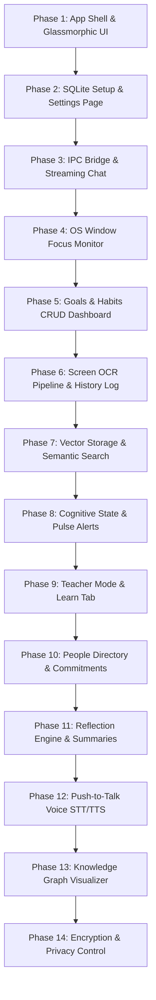

# Phased Execution Plan: Second Mind (PCOS)

This document outlines the phased, step-by-step implementation plan for the **Second Mind Personal Cognitive Operating System (PCOS)**. 

Each phase is designed to fit within a single development session, introducing incremental functionality while ensuring the application remains **fully runnable, visually testable, and functional** at the end of every step.

---

## Roadmap Dependency Graph

---

## Detailed Phase Breakdown

### Phase 1: App Shell & Glassmorphic Floating Widget UI
* **Objectives:** 
  * Initialize a React 18 + TypeScript + Vite project wrapped in a Tauri 2.0 shell.
  * Establish the styling framework with Tailwind CSS and Radix UI.
  * Implement the Floating Widget container.
* **UX/Visual Impact:** 
  * A borderless, translucent window (glassmorphism look: backdrop blur, dark slate/violet theme) floating above all other windows.
  * The widget operates in two modes:
    * **Minimal Mode:** Shows an interactive avatar icon (with idle/thinking states) and a subtle halo pulse.
    * **Expanded Mode:** Transitions smoothly into a 380px wide card with mock tabs for *Chat*, *Context*, *Goals*, and *Habits*.
  * Clicking outside the expanded panel minimizes it back to the avatar.
  * Keyboard shortcut `Ctrl+Shift+M` toggles widget visibility.
* **Under-the-Hood Tasks:**
  * Tauri window configuration set to `transparent: true`, `decorations: false`, and `always_on_top: true`.
  * Set up global shortcut listener in Rust.
* **Verification:** 
  * Build and run the Tauri application. Verify the floating widget sits on the desktop, expands/collapses on click, responds to the keyboard shortcut, and animates smoothly using Framer Motion.

---

### Phase 2: Local Database Setup & User Profile/Preferences Settings
* **Objectives:**
  * Connect a local SQLite database using SQLx (Rust side) and Prisma client (TypeScript side).
  * Build the persistent user configuration schema.
* **UX/Visual Impact:**
  * A settings gear icon added to the Floating Widget.
  * Clicking the icon opens a dashboard modal displaying a clean preferences panel.
  * The user can fill out profile information (Name, Timezone, Theme) and save it.
* **Under-the-Hood Tasks:**
  * Initialize the SQLite schema with tables for `users` and `user_preferences` (as detailed in the DB design).
  * Build Tauri command endpoints to write and read settings.
  * Save settings securely in the platform's standard AppData directory.
* **Verification:**
  * Launch the app, enter a custom user name in settings, and save.
  * Relaunch the app and verify that the greeting message displays the stored name, confirming successful database read/write.

---

### Phase 3: IPC Bridge & Streaming Chat Interface
* **Objectives:**
  * Establish type-safe Tauri IPC commands for text processing.
  * Build a functional streaming chat UI simulating local LLM processing.
* **UX/Visual Impact:**
  * The *Chat* tab displays a scrollable message list and a prompt input field.
  * Typing a question and clicking "Send" renders the user's message, displays a typing indicator, and then streams back a mocked markdown response word-by-word.
* **Under-the-Hood Tasks:**
  * Build a Rust background thread communicating with a dummy model wrapper (simulating token streaming over IPC events).
  * Integrate custom Lucide icons for chat roles.
* **Verification:**
  * Submit several chat queries and observe the streaming response. Scroll through the message history to verify layout stability and auto-scroll behaviors.

---

### Phase 4: OS Window Focus Monitor
* **Objectives:**
  * Implement native desktop window tracking.
* **UX/Visual Impact:**
  * The *Context* tab in the Floating Widget changes dynamically.
  * It displays the logo/icon, name, and window title of the currently focused application on the user's desktop (e.g., "Active: VS Code — index.tsx").
* **Under-the-Hood Tasks:**
  * Write a Rust sidecar monitor loop (using OS APIs or crates like `active-win-pos-rs`) polling the active window context every 5 seconds.
  * Emit events over the Tauri IPC channel to update React state.
* **Verification:**
  * Switch between various open applications (Web Browser, Editor, File Explorer) and verify the *Context* panel immediately updates to reflect the active window.

---

### Phase 5: Goals & Habits CRUD Dashboard
* **Objectives:**
  * Implement the persistence schemas for goals and habits.
  * Create interactive CRUD views for managing tasks.
* **UX/Visual Impact:**
  * **Goals Tab:** Displays active high-level targets with status bars. Includes a quick-add dialog (Title, Type, Target Date).
  * **Habits Tab:** Lists daily routines with simple check-mark toggles that visually trigger a celebration animation on completion.
* **Under-the-Hood Tasks:**
  * Add the `goals` and `habits` schemas to the SQLite database.
  * Build backend controllers for creating, updating, checking off, and deleting records.
* **Verification:**
  * Create a new weekly goal, check off a habit, close the app, and reopen it. Verify that the checklist states and goal completion percentages remain correct.

---

### Phase 6: Screen OCR Pipeline & History Log
* **Objectives:**
  * Implement background screen-capture logic.
  * Extract visible text using platform-native OCR libraries.
* **UX/Visual Impact:**
  * A developer-facing "Screen Log" option is added to the Settings dashboard.
  * Displays a chronological list of timestamps, app categories, and the text read from the screen in past intervals.
* **Under-the-Hood Tasks:**
  * Rust background service captures screen frames periodically (e.g., every 10 seconds).
  * Pass raw frames to Windows native OCR APIs (`Windows.Media.Ocr`).
  * Process extracted texts and categorize the activity type (coding, reading, chatting).
* **Verification:**
  * Open a text document, let the app run for 20 seconds, and view the developer log. Confirm that key phrases from the document are listed with high confidence.

---

### Phase 7: Vector Storage & Semantic Search
* **Objectives:**
  * Integrate Qdrant database in embedded/local mode.
  * Generate text embeddings and store OCR content for semantic retrieval.
* **UX/Visual Impact:**
  * The Chat tab displays an optional search filter: "Search my history."
  * Typing a query search (e.g., "Where did I save the API keys?") displays a list of search snippets matching historical screen-capture content.
* **Under-the-Hood Tasks:**
  * Set up local Qdrant instance/embedded integration.
  * Build a Rust utility to run local text embeddings using `fastembed-rs` (nomic-embed-text).
  * Index screen OCR payloads in Qdrant; build a retrieval function linking matches back to SQLite rows.
* **Verification:**
  * Open a unique web page (e.g., a specific recipe or technical paper). 5 minutes later, type a keyword related to the page in the search box and verify that the page title is retrieved.

---

### Phase 8: Cognitive State Engine & Pulse Alerts
* **Objectives:**
  * Implement cognitive state calculations.
  * Build the reactive proactivity loop.
* **UX/Visual Impact:**
  * The widget's avatar glows green (focused), yellow (fatigued), or blue (chatty) based on activity duration and transitions.
  * Toast alerts appear on-screen for proactive suggestions (e.g., "You have been writing code for 60 minutes. Would you like to log a short meditation break?").
* **Under-the-Hood Tasks:**
  * Implement the focus/fatigue logic inside the Rust orchestrator.
  * Score incoming actions against active user goals. Trigger notifications when thresholds are crossed.
* **Verification:**
  * Rapidly switch applications to simulate chaotic multitasking; observe the widget's focus indicator turn yellow and display a helpful micro-intervention card.

---

### Phase 9: Adaptive Teacher Mode & Learn Tab
* **Objectives:**
  * Build the active "Teacher Mode" agent framework.
* **UX/Visual Impact:**
  * A new *Learn* tab is added to the widget.
  * Clicking "Explain what I'm looking at" reads the active screen contents, summarizes the underlying code or text, and presents structured flashcards explaining the core concepts.
* **Under-the-Hood Tasks:**
  * Write the Teacher Agent instructions, feeding the extracted screen context and learning level (e.g., Beginner, Advanced) to the LLM.
  * Create a database table for tracking user comprehension scores per topic.
* **Verification:**
  * Open a code file or complex technical page. Click the "Explain" button in the Learn tab and verify it breaks down the concepts cleanly using the active text context.

---

### Phase 10: People Directory & Commitments
* **Objectives:**
  * Build the Relationship Intelligence database layer and UI.
* **UX/Visual Impact:**
  * A "People" screen is added to the primary dashboard.
  * Displays card grids of tracked contacts, logging names, relationship status, communication frequency goals, and dynamic action items (e.g., "Ask Sarah about the design system review").
* **Under-the-Hood Tasks:**
  * Write SQLite schema migrations for contact cards and relationship commitments.
  * Synthesize interaction details when a window name matches popular chat platforms (e.g., WhatsApp, Slack, Teams) to identify commitment deadlines.
* **Verification:**
  * Add a contact with a 1-week interaction goal. Set a manual reminder to follow up. Confirm that the contact card reflects the correct status and timeline.

---

### Phase 11: Reflection Engine, Daily Summaries & Insights View
* **Objectives:**
  * Construct the Reflection Agent engine.
  * Synthesize daily activities into visual metrics.
* **UX/Visual Impact:**
  * At the end of the user's day, the widget expands to reveal a "Daily Reflection" prompt.
  * Displays graphs showing focus hours, habit completion rates, and an auto-generated narrative summary of what the user worked on.
  * Offers three journal input boxes for qualitative feedback.
* **Under-the-Hood Tasks:**
  * Implement daily context log rollup logic.
  * Create visual datasets for focus trends and deliver them to Recharts.
* **Verification:**
  * Log mock database events for habits and goals across a day. Open the reflection tab and verify that the summaries and progress graphs compile the simulated day accurately.

---

### Phase 12: Push-to-Talk Voice System (STT/TTS)
* **Objectives:**
  * Integrate audio processing services into the Tauri application.
* **UX/Visual Impact:**
  * A microphone button is added inside the Chat panel.
  * Clicking and holding the button records audio, showing a waveform animation.
  * Releasing the button sends the message, prints the transcribed text, and plays back the AI's audio response.
* **Under-the-Hood Tasks:**
  * Implement Rust-based audio input recording via CPAL.
  * Route voice recordings through local Whisper bindings for Speech-to-Text.
  * Route LLM text responses through local Kokoro-82M bindings for Text-to-Speech playback.
* **Verification:**
  * Hold the mic button, speak a simple question, release, and confirm the text prints accurately and the system reads the answer back over your system audio output.

---

### Phase 13: Knowledge Graph Visualizer
* **Objectives:**
  * Integrate SurrealDB in embedded mode.
  * Render an interactive mind map of entities and connections.
* **UX/Visual Impact:**
  * The dashboard features a "Knowledge Map" view.
  * Displays an interactive 2D graph node network. Nodes represent Goals, Concepts, People, and Projects, linked by labeled lines (e.g., `Goal A` -> `requires` -> `Concept B`).
  * The network updates dynamically when nodes are dragged, clicked, or searched.
* **Under-the-Hood Tasks:**
  * Connect the SurrealDB Rust library. Set up node/edge schemas.
  * Traverse SQLite records, populate SurrealDB nodes, and output JSON maps for React Force Graph.
* **Verification:**
  * Create a goal linked to a specific person and a habit. Open the Knowledge Map, verify all three nodes display correctly, and drag nodes to test physics layout rendering.

---

### Phase 14: Encryption & Privacy Control
* **Objectives:**
  * Implement SQLCipher database encryption.
  * Create complete local control switches for all data streams.
* **UX/Visual Impact:**
  * The settings panel includes a "Privacy & Security" section.
  * Users can set database encryption passwords, choose memory retention periods, clear the database with one click, and export all history as Markdown/JSON.
* **Under-the-Hood Tasks:**
  * Implement SQLite encryption using SQLCipher bindings.
  * Build automated job hooks to purge memory older than the user's specified retention limit.
  * Construct a ZIP file exporter capturing JSON files and database tables.
* **Verification:**
  * Toggle screen capture to off; verify no screenshot files are created in AppData. Run the backup tool and inspect the exported file contents to confirm data transparency.
