# Second Mind: Personal Cognitive Operating System (PCOS)
## Product Requirements Document — Master Blueprint

**Version:** 1.0.0  
**Classification:** Confidential — Technical Founder Reference  
**Audience:** Engineering, Product, Design, AI/ML, Investors  
**Purpose:** Complete implementation blueprint for AI-assisted development (Cursor, Claude Code, Windsurf, Replit Agent)

---

## Table of Contents

1. [Executive Summary](#1-executive-summary)
2. [Product Vision & Philosophy](#2-product-vision--philosophy)
3. [Core Design Principles](#3-core-design-principles)
4. [System Architecture Overview](#4-system-architecture-overview)
5. [Agent Architecture](#5-agent-architecture)
6. [Memory System](#6-memory-system)
7. [Knowledge Graph](#7-knowledge-graph)
8. [Screen Awareness Engine](#8-screen-awareness-engine)
9. [Camera & Biometric Awareness](#9-camera--biometric-awareness)
10. [Cognitive State Modeling](#10-cognitive-state-modeling)
11. [Personal Alignment System](#11-personal-alignment-system)
12. [Feedback Engine](#12-feedback-engine)
13. [Teacher Mode](#13-teacher-mode)
14. [Life Management System](#14-life-management-system)
15. [Relationship Intelligence](#15-relationship-intelligence)
16. [Health & Wellbeing System](#16-health--wellbeing-system)
17. [Goal Alignment Engine](#17-goal-alignment-engine)
18. [Proactive Assistance Engine](#18-proactive-assistance-engine)
19. [Friend Mode & Personality Architecture](#19-friend-mode--personality-architecture)
20. [Voice System](#20-voice-system)
21. [Reflection Engine](#21-reflection-engine)
22. [Desktop Application UX Specification](#22-desktop-application-ux-specification)
23. [Security Architecture](#23-security-architecture)
24. [Privacy System](#24-privacy-system)
25. [Technology Stack](#25-technology-stack)
26. [Database Design](#26-database-design)
27. [API Design](#27-api-design)
28. [Edge Cases & Failure Modes](#28-edge-cases--failure-modes)
29. [Product Roadmap](#29-product-roadmap)
30. [Appendices](#30-appendices)

---

## 1. Executive Summary

### 1.1 What Is Second Mind?

Second Mind is a **Personal Cognitive Operating System (PCOS)** — a persistent, continuously-running AI companion that lives on the user's desktop. It is not a chatbot. It is not a productivity app. It is an entirely new category of software: an AI that thinks *alongside* the user, rather than waiting to be asked.

Second Mind observes what the user sees, understands what they are doing and why, builds a deep persistent model of their mind, goals, relationships, and habits, and proactively assists at precisely the right moments — in the right way, with the right depth, through the right medium.

The closest analogy is **a highly intelligent, deeply caring, perpetually-available friend and mentor who happens to have the knowledge of a doctor, lawyer, financial advisor, therapist, professor, and world-class coach** — and who never forgets anything you've shared, never judges you, always wants what's best for you, and gets smarter about you over time.

### 1.2 The Problem

Modern knowledge workers, learners, and ambitious individuals face a profound paradox:

- They have access to more information than any human in history
- They are more distracted, more overwhelmed, and more cognitively burdened than ever
- They use dozens of disconnected tools that don't talk to each other
- AI tools require them to constantly re-explain their context
- No tool remembers who they are, what they care about, or what they're trying to achieve
- Learning is fragmented; growth is unmeasured; relationships are managed in spreadsheets
- The gap between knowing and doing is enormous

**The result:** Talented, motivated people consistently underperform their potential — not from lack of effort, but from lack of a coherent cognitive infrastructure.

### 1.3 The Solution

Second Mind is the **missing cognitive layer** between the user and everything they do. It:

- **Observes** continuously — screen, camera (optional), audio (optional)
- **Understands** deeply — context, intent, emotion, cognitive state
- **Remembers** everything — with structured, queryable, exportable memory
- **Learns** continuously — from behavior, feedback, outcomes
- **Aligns** relentlessly — to the user's values, goals, preferences, and growth
- **Predicts** intelligently — next needs, blockers, mistakes, opportunities
- **Assists** precisely — right message, right moment, right depth

### 1.4 Target Users

**Primary:**
- Knowledge workers (engineers, designers, product managers, researchers, writers)
- Lifelong learners (autodidacts, graduate students, professionals upskilling)
- Ambitious individuals building toward significant personal and professional goals

**Secondary:**
- Founders and executives who need a "chief of staff" AI
- Students preparing for high-stakes learning or exams
- Professionals in complex, high-cognitive-load fields (medicine, law, finance, engineering)

**Tertiary:**
- Anyone who wants to be a better version of themselves

### 1.5 Key Differentiators

| Feature | Second Mind | ChatGPT | Copilot | Notion AI | Rewind |
|---------|-------------|---------|---------|-----------|--------|
| Persistent memory | ✅ Deep | ❌ Session | ❌ Session | ❌ None | ✅ Basic |
| Screen awareness | ✅ Continuous | ❌ | ❌ | ❌ | ✅ Recording |
| Cognitive modeling | ✅ Full | ❌ | ❌ | ❌ | ❌ |
| Goal alignment | ✅ Always | ❌ | ❌ | ❌ | ❌ |
| Teacher mode | ✅ Adaptive | ❌ | ❌ | ❌ | ❌ |
| Relationship intelligence | ✅ | ❌ | ❌ | ❌ | ❌ |
| Proactive assistance | ✅ Predictive | ❌ | ✅ Basic | ❌ | ❌ |
| Local-first privacy | ✅ | ❌ | ❌ | ❌ | ✅ |
| Personal alignment engine | ✅ | ❌ | ❌ | ❌ | ❌ |
| Voice persona | ✅ Multiple | ✅ Basic | ✅ Basic | ❌ | ❌ |

---

## 2. Product Vision & Philosophy

### 2.1 The Vision Statement

> Second Mind is a lifelong AI companion that continuously thinks alongside the user — observing, understanding, remembering, learning, and assisting — so that the user can become the best version of themselves.

### 2.2 The Core Loop

Traditional AI operates on a **request-response** model:

```
User → [Has a question] → Types it → AI answers → Done
```

Second Mind operates on a **continuous cognitive partnership** model:

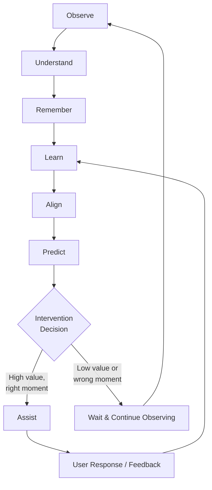

Every component of this loop is active, always running, always improving.

### 2.3 The Philosophy of Observation

Second Mind watches but does not surveil. It observes to *help*, not to *monitor*. The distinction is critical:

- **Surveillance:** Watching to control, judge, or report
- **Observation:** Watching to understand, support, and assist

Every piece of data collected is used exclusively to benefit the user. The user owns all data. The user can delete any memory at any time. The user can pause observation at any time.

### 2.4 The Philosophy of Memory

Memory is not a database. Memory is identity.

What Second Mind remembers is not a log of events — it is an evolving model of the user's mind:

- What they know and don't know
- What they care about and why
- Who matters to them
- What they're working toward
- What has worked and what hasn't
- How they think, learn, and communicate

This memory is sacred. It belongs to the user. It can be exported at any time in open formats. It is never sold, never shared, never used to train models without explicit consent.

### 2.5 The Philosophy of Assistance

Second Mind never assists for the sake of assisting. Every intervention must pass a value filter:

1. **Is this genuinely useful to the user right now?**
2. **Is this the right moment?**
3. **Is this the right medium?**
4. **Does this align with the user's goals?**
5. **Does this align with the user's preferences for assistance depth?**

If any filter fails, Second Mind stays silent. The cost of an unhelpful interruption is higher than the benefit of a missed opportunity.

### 2.6 The Philosophy of Growth

Second Mind is not a crutch. It is a scaffold.

The goal is not to do things for the user — it is to help the user become capable of doing things better themselves. A great teacher doesn't do your homework; they help you understand deeply enough that you can do it, and harder things, yourself.

Second Mind explicitly tracks user growth over time and adapts its assistance level accordingly. As the user becomes more capable, Second Mind steps back in those areas and deepens in new ones.

---

## 3. Core Design Principles

### Principle 1: Observe Before Speaking
The system must build a high-confidence model of the current situation before offering any assistance. Premature assistance is worse than no assistance.

### Principle 2: Memory Is Sacred
All user data is encrypted, local-first, user-owned, and exportable. No data is used for training without explicit, informed, revocable consent.

### Principle 3: Radical Personalization
No two users experience Second Mind the same way. Every aspect of behavior — tone, depth, frequency, modality, timing — is shaped by continuous learning about the specific user.

### Principle 4: Calibrated Confidence
The system must never overclaim. All assessments — of cognitive state, intent, emotion — are probabilistic and must be communicated as such. "You seem frustrated" not "You are frustrated."

### Principle 5: Never Manipulate
Second Mind must never exploit psychological vulnerabilities, create dependency, use dark patterns, or nudge users toward behaviors that serve the product rather than the user.

### Principle 6: Local-First
The core experience must work entirely on-device. Cloud features are opt-in enhancements, not requirements. The user's data never leaves their machine without their explicit, informed consent.

### Principle 7: Graceful Degradation
Every feature must have a graceful offline fallback. If local models are unavailable, the system degrades gracefully rather than failing completely.

---

## 4. System Architecture Overview

### 4.1 High-Level Architecture

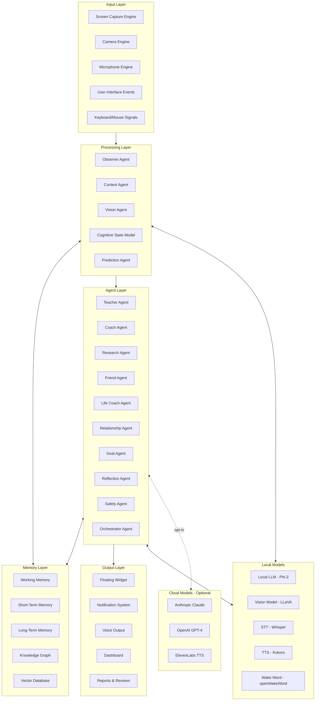

### 4.2 Data Flow Architecture

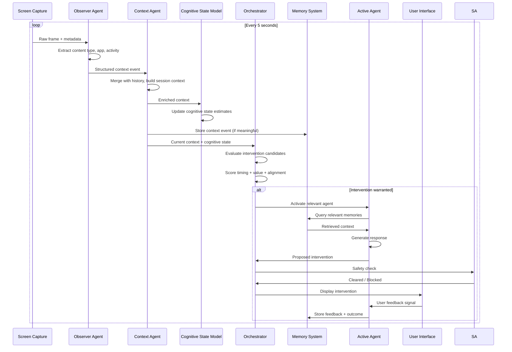

### 4.3 Local vs. Cloud Decision Matrix

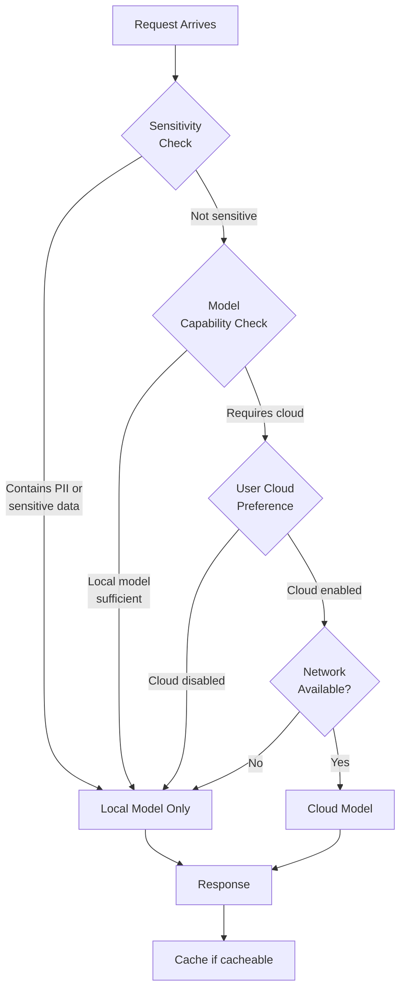

### 4.4 Security Boundary Architecture

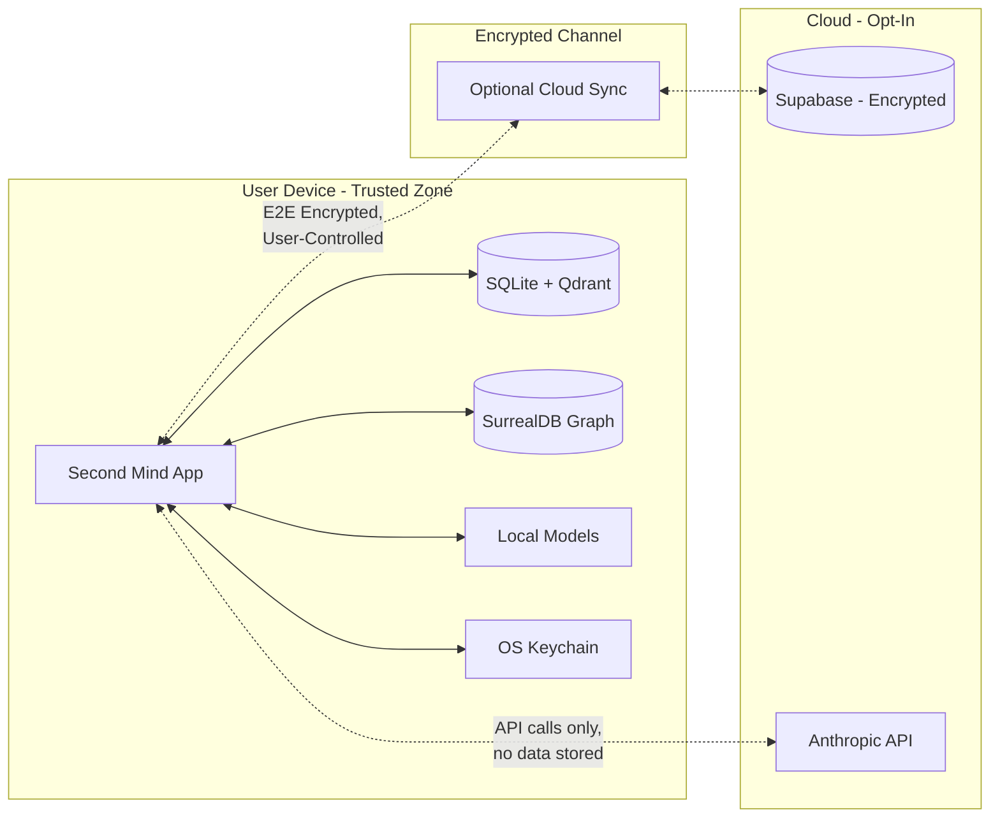

---

## 5. Agent Architecture

### 5.1 Overview

Second Mind uses a **multi-agent orchestration architecture**. Sixteen specialized agents operate under the direction of a master Orchestrator Agent. Each agent has a clearly defined domain, input contract, output contract, and system prompt.

```mermaid
graph TB
    ORC[Orchestrator Agent] --> OA[Observer Agent]
    ORC --> CA[Context Agent]
    ORC --> VA[Vision Agent]
    ORC --> MA[Memory Agent]
    ORC --> TA[Teacher Agent]
    ORC --> CHA[Coach Agent]
    ORC --> LA[Life Coach Agent]
    ORC --> REL[Relationship Agent]
    ORC --> GA[Goal Agent]
    ORC --> RA[Research Agent]
    ORC --> REF[Reflection Agent]
    ORC --> SA[Safety Agent]
    ORC --> ALN[Alignment Agent]
    ORC --> FA[Friend Agent]
    ORC --> PA[Planning Agent]
    ORC --> CSM[Cognitive State Monitor]
```

### 5.2 Orchestrator Agent

**Responsibility:** The master coordinator. Routes tasks to appropriate agents, manages intervention timing, prevents agent conflicts, and ensures global coherence.

**Inputs:**
```typescript
interface OrchestratorInput {
  currentContext: SessionContext;
  cognitiveState: CognitiveStateSnapshot;
  activeGoals: Goal[];
  pendingInterventions: InterventionCandidate[];
  userPreferences: UserPreferenceModel;
  recentFeedback: FeedbackEvent[];
  timeOfDay: string;
  lastInterventionAt: Date | null;
  currentMode: AppMode; // 'focus' | 'learning' | 'relaxed' | 'conversation'
}
```

**Outputs:**
```typescript
interface OrchestratorDecision {
  action: 'intervene' | 'wait' | 'queue' | 'dismiss';
  selectedAgent: AgentType | null;
  interventionPriority: number; // 0-100
  scheduledAt: Date | null;
  rationale: string;
  estimatedUserValue: number; // 0-100
  estimatedInterruptionCost: number; // 0-100
}
```

**System Prompt:**
```
You are the Orchestrator of Second Mind, a personal cognitive operating system.

Your role is to:
1. Evaluate all pending intervention candidates
2. Select the highest-value intervention given current context and timing
3. Route the task to the correct specialized agent
4. Prevent redundant, untimely, or low-value interruptions
5. Maintain the trust relationship by never being annoying

Rules:
- Never interrupt during deep focus unless urgency score > 90
- Prefer batching multiple low-priority items over individual interruptions
- Respect the user's stated intervention preferences absolutely
- When in doubt, wait — silence preserves trust
- Always consider the cost of interruption vs. value of assistance
- Prefer right timing over right now
```

**Intervention Scoring Algorithm:**
```typescript
function scoreIntervention(
  candidate: InterventionCandidate,
  context: OrchestratorInput
): number {
  const baseValue = candidate.estimatedValue; // 0-100
  
  // Timing modifiers
  const focusModifier = context.cognitiveState.focusLevel > 0.8 ? 0.2 : 1.0;
  const fatigueModifier = context.cognitiveState.mentalFatigue > 0.7 ? 0.5 : 1.0;
  const recentInterruptionModifier = minutesSince(context.lastInterventionAt) < 5 ? 0.3 : 1.0;
  
  // Preference modifiers
  const proactivityScore = context.userPreferences.interventionProactivity; // 0-100
  const proactivityModifier = proactivityScore / 100;
  
  // Goal alignment modifier
  const goalAlignment = computeGoalAlignment(candidate, context.activeGoals); // 0-1
  const goalModifier = 0.5 + (goalAlignment * 0.5);
  
  // Urgency override
  if (candidate.urgency > 90) return 95;
  
  return Math.min(100, 
    baseValue * focusModifier * fatigueModifier * 
    recentInterruptionModifier * proactivityModifier * goalModifier
  );
}
```

### 5.3 Observer Agent

**Responsibility:** Continuously processes raw screen captures, identifies the current application, activity type, and content category. Emits structured context events.

**Inputs:**
```typescript
interface ObserverInput {
  rawFrame: ImageData;
  previousFrame: ImageData | null;
  activeWindow: WindowMetadata;
  cursorPosition: { x: number; y: number };
  recentKeystrokes: number; // count, not content
  recentMouseEvents: number;
  timestamp: Date;
}

interface WindowMetadata {
  appName: string;
  windowTitle: string;
  url?: string; // for browser
  filePath?: string; // for editors
  pid: number;
}
```

**Outputs:**
```typescript
interface ObservedContext {
  appType: AppType;
  activityType: ActivityType;
  contentCategory: ContentCategory;
  extractedContent: ExtractedContent;
  confidence: number; // 0-1
  changeFromPrevious: ContextDelta;
  timestamp: Date;
}

type AppType =
  | 'browser' | 'code_editor' | 'terminal' | 'document_editor'
  | 'spreadsheet' | 'presentation' | 'pdf_viewer' | 'note_taking'
  | 'communication' | 'video_call' | 'media' | 'system' | 'unknown';

type ActivityType =
  | 'reading' | 'writing' | 'coding' | 'debugging' | 'researching'
  | 'designing' | 'communicating' | 'meeting' | 'learning' | 'browsing'
  | 'reviewing' | 'planning' | 'idle' | 'unknown';

type ContentCategory =
  | 'technical_documentation' | 'research_paper' | 'news_article'
  | 'tutorial' | 'codebase' | 'email' | 'chat' | 'spreadsheet_data'
  | 'presentation_slides' | 'video_content' | 'entertainment'
  | 'social_media' | 'unknown';
```

**Extraction Pipeline:**
```typescript
class ObserverAgent {
  async process(input: ObserverInput): Promise<ObservedContext> {
    // Step 1: Identify application
    const appType = this.classifyApp(input.activeWindow);
    
    // Step 2: Extract text content (OCR or accessibility API)
    const textContent = await this.extractText(input.rawFrame, appType);
    
    // Step 3: Classify activity
    const activityType = this.classifyActivity(appType, textContent, input);
    
    // Step 4: Extract structured content based on app type
    const extractedContent = await this.extractStructuredContent(
      appType, activityType, textContent, input
    );
    
    // Step 5: Compute delta from previous context
    const delta = this.computeDelta(extractedContent, this.previousContext);
    
    // Step 6: Assess confidence
    const confidence = this.assessConfidence(appType, textContent, delta);
    
    return {
      appType, activityType,
      contentCategory: this.classifyContent(extractedContent),
      extractedContent, confidence, changeFromPrevious: delta,
      timestamp: input.timestamp
    };
  }
  
  private extractText(frame: ImageData, appType: AppType): Promise<string> {
    // Use OS accessibility API first (lossless, no OCR needed)
    // Fall back to vision model OCR only when accessibility API fails
    if (this.canUseAccessibilityAPI(appType)) {
      return this.accessibilityAPI.getVisibleText();
    }
    return this.visionModel.ocr(frame);
  }
}
```

### 5.4 Context Agent

**Responsibility:** Maintains a rolling session context window. Merges incoming observer events with memory to build a rich, coherent understanding of what the user is doing and why.

**Inputs:**
```typescript
interface ContextAgentInput {
  newObservedContext: ObservedContext;
  sessionHistory: ObservedContext[]; // last 30 minutes
  relevantMemories: Memory[];
  userProfile: UserProfile;
  activeGoals: Goal[];
  currentProject: Project | null;
}
```

**Outputs:**
```typescript
interface SessionContext {
  sessionId: string;
  startedAt: Date;
  currentActivity: ActivitySummary;
  currentProject: Project | null;
  currentGoals: Goal[];
  recentTopics: Topic[];
  inferredIntent: string;
  inferredPurpose: string;
  contextConfidence: number;
  blockers: PotentialBlocker[];
  opportunities: AssistanceOpportunity[];
  sessionSummary: string;
}

interface ActivitySummary {
  primaryActivity: ActivityType;
  secondaryActivities: ActivityType[];
  durationMinutes: number;
  applicationTrail: AppTransition[];
  topicProgression: Topic[];
}
```

### 5.5 Vision Agent

**Responsibility:** Performs deep visual analysis of screen content — reading code, parsing documents, understanding diagrams, transcribing text from complex layouts.

**Inputs:**
```typescript
interface VisionAgentInput {
  frame: ImageData;
  context: ObservedContext;
  analysisType: VisionAnalysisType;
  region?: BoundingBox; // specific region of interest
}

type VisionAnalysisType =
  | 'full_ocr' | 'code_analysis' | 'diagram_understanding'
  | 'document_parse' | 'ui_understanding' | 'chart_reading'
  | 'face_detection' | 'emotion_estimation';
```

**Outputs:**
```typescript
interface VisionAnalysisResult {
  analysisType: VisionAnalysisType;
  extractedText?: string;
  structuredData?: Record<string, unknown>;
  codeAnalysis?: CodeAnalysis;
  documentStructure?: DocumentStructure;
  confidence: number;
  processingTimeMs: number;
}

interface CodeAnalysis {
  language: string;
  functions: string[];
  classes: string[];
  imports: string[];
  currentFunction: string | null;
  errorMarkers: ErrorMarker[];
  complexity: 'low' | 'medium' | 'high';
  estimatedPurpose: string;
}
```

### 5.6 Memory Agent

**Responsibility:** Manages all memory operations — storage, retrieval, consolidation, ranking, decay, and deletion. Acts as the memory interface for all other agents.

**Inputs:**
```typescript
interface MemoryAgentInput {
  operation: MemoryOperation;
  content?: string;
  query?: string;
  memoryType?: MemoryType;
  metadata?: MemoryMetadata;
  filters?: MemoryFilter;
  limit?: number;
}

type MemoryOperation =
  | 'store' | 'retrieve' | 'update' | 'delete' | 'consolidate'
  | 'search_semantic' | 'search_keyword' | 'search_temporal'
  | 'rank' | 'compress' | 'export';
```

**Outputs:**
```typescript
interface MemoryAgentResult {
  operation: MemoryOperation;
  success: boolean;
  memories?: Memory[];
  storedMemoryId?: string;
  consolidationSummary?: string;
  error?: string;
}
```

**Memory Selection Algorithm:**
```typescript
class MemoryAgent {
  async retrieve(query: string, context: SessionContext, limit: number = 10): Promise<Memory[]> {
    // Multi-strategy retrieval
    const [semanticResults, keywordResults, temporalResults, graphResults] = await Promise.all([
      this.vectorDB.similaritySearch(query, limit * 2),
      this.sqliteDB.keywordSearch(query, limit * 2),
      this.getRecentlyRelevant(context, limit),
      this.knowledgeGraph.traverseRelated(context.currentTopics, 2)
    ]);
    
    // Merge and deduplicate
    const merged = this.deduplicateByMemoryId([
      ...semanticResults, ...keywordResults,
      ...temporalResults, ...graphResults
    ]);
    
    // Score each memory
    const scored = merged.map(m => ({
      memory: m,
      score: this.scoreMemory(m, query, context)
    }));
    
    // Sort by score and return top results
    return scored
      .sort((a, b) => b.score - a.score)
      .slice(0, limit)
      .map(s => s.memory);
  }
  
  private scoreMemory(memory: Memory, query: string, context: SessionContext): number {
    const recencyScore = this.computeRecencyScore(memory.lastAccessedAt);
    const frequencyScore = Math.log(memory.accessCount + 1) / 10;
    const relevanceScore = memory.semanticScore || 0;
    const importanceScore = memory.importance / 100;
    const goalAlignmentScore = this.computeGoalAlignment(memory, context.currentGoals);
    
    return (
      relevanceScore * 0.4 +
      recencyScore * 0.2 +
      frequencyScore * 0.15 +
      importanceScore * 0.15 +
      goalAlignmentScore * 0.1
    );
  }
}
```

### 5.7 Teacher Agent

**Responsibility:** Provides adaptive, personalized education. Explains concepts, generates examples and analogies, creates quizzes, tracks understanding, and adjusts teaching style.

**Inputs:**
```typescript
interface TeacherAgentInput {
  topic: string;
  userKnowledgeLevel: KnowledgeLevel;
  teachingStyle: TeachingStyle;
  learningHistory: LearningEvent[];
  currentContext: SessionContext;
  requestType: TeachingRequestType;
  userQuestion?: string;
}

type TeachingRequestType =
  | 'explain_concept' | 'generate_example' | 'create_analogy'
  | 'quiz_user' | 'evaluate_understanding' | 'suggest_next_topic'
  | 'summarize_session' | 'identify_gaps';
```

**System Prompt Template:**
```
You are Second Mind's Teacher Agent — a world-class adaptive educator.

Current Teaching Style: {teachingStyle}
User Knowledge Level on {topic}: {knowledgeLevel}/10
Recent Learning History: {learningHistory}
Current Context: {currentContext}

Your teaching principles:
1. Meet the user exactly where they are — not above, not below
2. Use concrete examples before abstract principles
3. Check understanding before advancing
4. Celebrate genuine progress without being patronizing
5. When the user is confused, try a completely different angle
6. Build on what they already know — connect new to existing knowledge
7. Make it interesting — curiosity is the engine of learning

Current request: {requestType}
```

### 5.8 Coach Agent

**Responsibility:** Provides performance coaching, habit formation support, productivity optimization, and work quality feedback.

**Inputs:**
```typescript
interface CoachAgentInput {
  coachingDomain: CoachingDomain;
  currentPerformance: PerformanceMetrics;
  historicalPerformance: PerformanceMetrics[];
  activeHabits: Habit[];
  userGoals: Goal[];
  recentFeedback: FeedbackEvent[];
}

type CoachingDomain =
  | 'productivity' | 'focus' | 'time_management' | 'work_quality'
  | 'habit_formation' | 'decision_making' | 'communication'
  | 'stress_management' | 'energy_management';
```

### 5.9 Life Coach Agent

**Responsibility:** Maintains oversight of the user's entire life — balance, wellbeing, long-term trajectory. Operates on a longer time horizon than the Coach Agent.

**Inputs:**
```typescript
interface LifeCoachAgentInput {
  lifeAreas: LifeAreaAssessment[];
  longTermGoals: Goal[];
  recentReflections: Reflection[];
  healthData: HealthProfile;
  relationshipSummary: RelationshipSummary;
  careerTrajectory: CareerSnapshot;
}
```

**System Prompt:**
```
You are Second Mind's Life Coach — a deeply wise, caring advisor who sees the whole person.

You think in months and years, not hours and days.
You notice patterns the user may not see in themselves.
You ask questions more than you give answers.
You celebrate who the user is becoming, not just what they're achieving.
You never moralize or lecture.
You trust the user's capacity for growth.
You speak the truth with kindness.

Current life context: {lifeContext}
```

### 5.10 Research Agent

**Responsibility:** Performs deep research tasks — synthesizing information from screen content, the web (optional), and memory to answer complex questions.

**Inputs:**
```typescript
interface ResearchAgentInput {
  researchQuery: string;
  depth: 'quick' | 'standard' | 'deep';
  sources: ResearchSource[];
  existingKnowledge: Memory[];
  outputFormat: 'summary' | 'outline' | 'full_report' | 'bullet_points';
}
```

### 5.11 Friend Agent

**Responsibility:** Provides emotional support, casual conversation, encouragement, and a warm human-like presence. Activates during low-cognitive-load moments.

**System Prompt:**
```
You are Second Mind's Friend — the warm, human heart of the system.

You are:
- Genuinely interested in the user as a person
- Warm without being saccharine
- Honest without being blunt
- Encouraging without being a cheerleader
- Present without being clingy
- Playful when the moment allows
- Serious when the moment demands

You are NOT:
- Therapeutic (refer to professionals when needed)
- Manipulative
- Dependent-creating
- Flattering beyond honesty

Current emotional context: {emotionalContext}
Recent user mood signals: {moodSignals}
```

### 5.12 Relationship Agent

**Responsibility:** Maintains the user's relationship graph, tracks commitments and follow-ups, generates relationship insights, and proactively surfaces relationship opportunities.

**Inputs:**
```typescript
interface RelationshipAgentInput {
  personId?: string;
  operation: RelationshipOperation;
  interactionContext?: string;
  query?: string;
}

type RelationshipOperation =
  | 'add_person' | 'update_person' | 'log_interaction'
  | 'get_insights' | 'find_follow_ups' | 'analyze_relationship'
  | 'suggest_action' | 'surface_commitments';
```

### 5.13 Goal Agent

**Responsibility:** Manages the user's goal hierarchy, evaluates goal progress, identifies blockers, and ensures every recommendation aligns with active goals.

**Inputs:**
```typescript
interface GoalAgentInput {
  operation: GoalOperation;
  goalId?: string;
  currentContext: SessionContext;
  recentActivity: ActivitySummary[];
}

type GoalOperation =
  | 'evaluate_progress' | 'identify_blockers' | 'suggest_next_action'
  | 'check_alignment' | 'generate_milestones' | 'weekly_review'
  | 'decompose_goal' | 'prioritize_goals';
```

### 5.14 Reflection Agent

**Responsibility:** Generates daily, weekly, monthly, and annual reflection reports. Synthesizes patterns, generates insights, and surfaces growth opportunities.

### 5.15 Safety Agent

**Responsibility:** Reviews all outgoing interventions for safety, appropriateness, and alignment with the user's values. Acts as a final gate before any content reaches the user.

**Safety Checks:**
```typescript
interface SafetyCheck {
  isHarmful: boolean;
  isMisleading: boolean;
  isManipulative: boolean;
  isInappropriate: boolean;
  isPrivacyViolating: boolean;
  overallSafe: boolean;
  blockedReason?: string;
  suggestedRevision?: string;
}
```

### 5.16 Alignment Agent

**Responsibility:** Continuously monitors whether Second Mind's behavior aligns with the user's stated and inferred preferences. Detects drift and triggers recalibration.

**Inputs:**
```typescript
interface AlignmentAgentInput {
  recentInterventions: Intervention[];
  userFeedback: FeedbackEvent[];
  userPreferences: UserPreferenceModel;
  behavioralSignals: BehavioralSignal[];
  lastAlignmentCheckAt: Date;
}

interface AlignmentReport {
  overallAlignmentScore: number; // 0-100
  dimensionScores: Record<AlignmentDimension, number>;
  driftDetected: boolean;
  driftDimensions: AlignmentDimension[];
  recommendedAdjustments: PreferenceAdjustment[];
  userNotificationRequired: boolean;
}
```

---

## 6. Memory System

### 6.1 Memory Architecture Overview

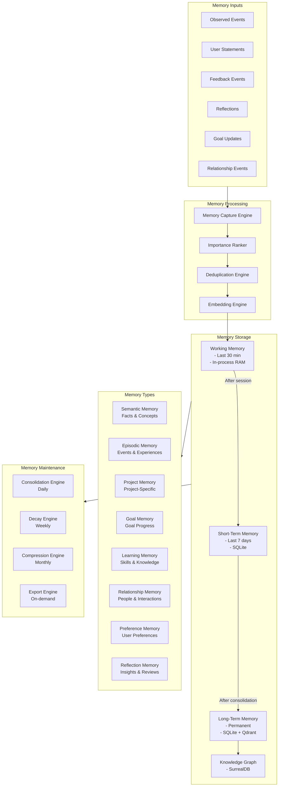

### 6.2 Memory Type Specifications

#### 6.2.1 Working Memory
```typescript
interface WorkingMemory {
  sessionId: string;
  items: WorkingMemoryItem[];
  maxItems: 50;
  retentionWindow: '30_minutes';
  storage: 'ram';
}

interface WorkingMemoryItem {
  id: string;
  content: string;
  type: 'context' | 'fact' | 'task' | 'question' | 'decision';
  addedAt: Date;
  accessCount: number;
  lastAccessedAt: Date;
  confidence: number; // 0-1
  linkedMemoryIds: string[];
}
```

#### 6.2.2 Short-Term Memory
```typescript
interface ShortTermMemory {
  retentionDays: 7;
  storage: 'sqlite';
  consolidationTrigger: 'daily_at_midnight';
  compressionThreshold: 1000; // items
}
```

#### 6.2.3 Long-Term Memory
```typescript
interface Memory {
  id: string;
  userId: string;
  type: MemoryType;
  content: string;
  summary: string;
  embedding: number[]; // 1536-dim vector
  importance: number; // 0-100
  confidence: number; // 0-100
  
  // Temporal
  createdAt: Date;
  lastAccessedAt: Date;
  accessCount: number;
  decayScore: number; // 0-1, lower = more decayed
  
  // Links
  relatedMemoryIds: string[];
  sourceContextId: string;
  relatedGoalIds: string[];
  relatedPersonIds: string[];
  relatedProjectIds: string[];
  
  // Metadata
  tags: string[];
  verified: boolean; // user confirmed this is accurate
  userEdited: boolean;
  deletedAt: Date | null;
  
  // Privacy
  sensitivityLevel: 'public' | 'private' | 'sensitive' | 'confidential';
  encryptionKeyId: string | null;
}

type MemoryType =
  | 'semantic'    // facts, concepts, knowledge
  | 'episodic'    // events, experiences, moments
  | 'procedural'  // how to do things
  | 'project'     // project-specific information
  | 'goal'        // goal-related progress and milestones
  | 'learning'    // skills and knowledge acquisition
  | 'relationship'// people and relationship information
  | 'preference'  // user preferences and values
  | 'reflection'  // insights from review sessions
  | 'commitment'  // promises and commitments made
  | 'habit';      // habit-related observations
```

#### 6.2.4 Semantic Memory
```typescript
interface SemanticMemory extends Memory {
  type: 'semantic';
  conceptName: string;
  definition: string;
  examples: string[];
  relatedConcepts: string[];
  domain: string; // 'programming' | 'mathematics' | 'biology' | ...
  userKnowledgeLevel: number; // 0-100
  lastTestedAt: Date | null;
  spaceRepetitionData: SM2Data | null;
}
```

#### 6.2.5 Episodic Memory
```typescript
interface EpisodicMemory extends Memory {
  type: 'episodic';
  eventDate: Date;
  location?: string;
  participants?: string[];
  emotionalValence: number; // -1 to 1
  emotionalIntensity: number; // 0-1
  outcome: string;
  lessonsLearned: string[];
}
```

#### 6.2.6 Learning Memory
```typescript
interface LearningMemory extends Memory {
  type: 'learning';
  skill: string;
  conceptId: string;
  proficiencyLevel: number; // 0-100
  proficiencyHistory: ProficiencySnapshot[];
  practiceCount: number;
  lastPracticedAt: Date;
  nextReviewAt: Date; // spaced repetition
  sm2Data: SM2Data;
  weakAreas: string[];
  strengthAreas: string[];
}

interface SM2Data {
  repetitions: number;
  easinessFactor: number; // 1.3-2.5
  interval: number; // days
  nextReviewDate: Date;
  lastQuality: number; // 0-5
}
```

#### 6.2.7 Relationship Memory
```typescript
interface RelationshipMemory extends Memory {
  type: 'relationship';
  personId: string;
  interactionType: 'in_person' | 'call' | 'message' | 'email' | 'observed';
  keyTopicsDiscussed: string[];
  commitmentsMade: Commitment[];
  emotionalTone: number; // -1 to 1
  importantFacts: string[];
  followUpRequired: boolean;
  followUpDueAt: Date | null;
}
```

### 6.3 Memory Creation Pipeline

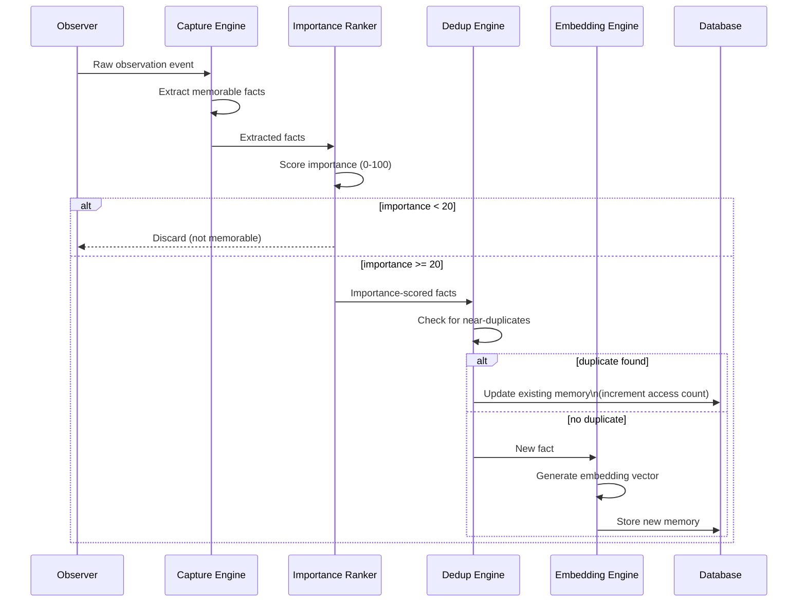

**Importance Scoring Algorithm:**
```typescript
function scoreImportance(event: ObservedEvent, context: SessionContext): number {
  let score = 0;
  
  // Recurrence bonus
  if (isRecurringTopic(event, context)) score += 20;
  
  // User engagement signals
  if (event.userDwellTimeSeconds > 60) score += 15;
  if (event.userTypeCount > 50) score += 10;
  
  // Explicit importance signals
  if (event.isBookmarked) score += 30;
  if (event.userHighlighted) score += 25;
  if (event.isGoalRelated) score += 20;
  
  // Content type bonuses
  const contentBonus: Record<ContentCategory, number> = {
    research_paper: 20, tutorial: 15, documentation: 10,
    email: 15, decision_artifact: 25, codebase: 10,
    social_media: 0, entertainment: 0
  };
  score += contentBonus[event.contentCategory] || 5;
  
  // Novelty bonus (new information not in memory)
  const noveltyScore = await this.assessNovelty(event);
  score += noveltyScore * 15;
  
  // Emotional intensity bonus
  if (event.emotionalIntensity > 0.6) score += 10;
  
  return Math.min(100, score);
}
```

### 6.4 Memory Consolidation Pipeline

Runs nightly at midnight (user-configurable).

```typescript
class MemoryConsolidationEngine {
  async consolidate(): Promise<ConsolidationReport> {
    // Step 1: Group related short-term memories
    const groups = await this.clusterRelatedMemories();
    
    // Step 2: Summarize each group
    const summaries = await Promise.all(
      groups.map(g => this.summarizeGroup(g))
    );
    
    // Step 3: Merge with existing long-term memories
    const merged = await this.mergeWithLongTerm(summaries);
    
    // Step 4: Update knowledge graph
    await this.updateKnowledgeGraph(merged);
    
    // Step 5: Rank memories by importance
    await this.rerankMemories();
    
    // Step 6: Apply decay to unaccessed memories
    await this.applyDecay();
    
    // Step 7: Compress highly redundant memories
    await this.compressRedundant();
    
    return this.generateReport();
  }
  
  private computeDecay(memory: Memory): number {
    const daysSinceAccess = daysBetween(memory.lastAccessedAt, new Date());
    const importanceFactor = memory.importance / 100;
    
    // Ebbinghaus forgetting curve adjusted for importance
    // High importance memories decay much slower
    const decayRate = 0.1 * (1 - importanceFactor * 0.8);
    return Math.exp(-decayRate * daysSinceAccess);
  }
}
```

### 6.5 Memory Retrieval Strategies

```typescript
class MemoryRetrievalEngine {
  // Strategy 1: Semantic similarity search
  async semanticSearch(query: string, limit: number): Promise<Memory[]> {
    const queryEmbedding = await this.embed(query);
    return this.vectorDB.similaritySearch(queryEmbedding, limit, {
      minScore: 0.75
    });
  }
  
  // Strategy 2: Temporal search
  async temporalSearch(timeRange: DateRange, limit: number): Promise<Memory[]> {
    return this.sqlite.query(
      'SELECT * FROM memories WHERE created_at BETWEEN ? AND ? ORDER BY importance DESC LIMIT ?',
      [timeRange.start, timeRange.end, limit]
    );
  }
  
  // Strategy 3: Entity-based search
  async entitySearch(entityId: string, entityType: string): Promise<Memory[]> {
    return this.sqlite.query(
      'SELECT * FROM memories WHERE ? = ANY(related_entity_ids) AND entity_type = ?',
      [entityId, entityType]
    );
  }
  
  // Strategy 4: Graph traversal
  async graphSearch(startNodeId: string, depth: number): Promise<Memory[]> {
    return this.knowledgeGraph.traverse(startNodeId, {
      maxDepth: depth,
      edgeTypes: ['related_to', 'supports', 'contradicts', 'extends']
    });
  }
  
  // Strategy 5: Contextual retrieval (most powerful)
  async contextualRetrieval(context: SessionContext): Promise<Memory[]> {
    const queries = [
      context.inferredIntent,
      context.currentProject?.name,
      ...context.recentTopics.map(t => t.name),
      ...context.currentGoals.map(g => g.title)
    ].filter(Boolean) as string[];
    
    const allResults = await Promise.all(
      queries.map(q => this.semanticSearch(q, 5))
    );
    
    return this.rankAndDeduplicate(allResults.flat(), context);
  }
}
```

### 6.6 Memory Export Formats

```typescript
interface MemoryExportOptions {
  format: 'json' | 'markdown' | 'csv' | 'obsidian' | 'notion' | 'roam';
  memoryTypes: MemoryType[];
  dateRange: DateRange | 'all';
  includeEmbeddings: boolean;
  includeMetadata: boolean;
  encryptExport: boolean;
  exportPassword?: string;
}
```

---

## 7. Knowledge Graph

### 7.1 Graph Schema

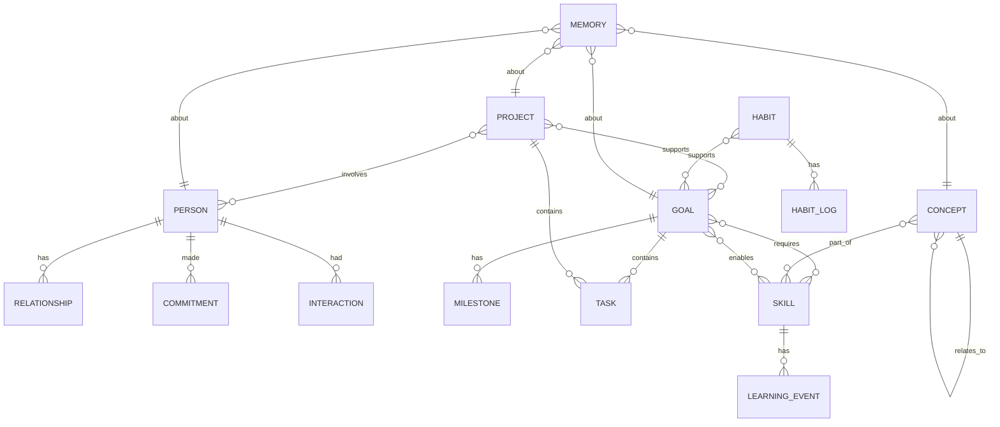

### 7.2 Node Type Definitions

```typescript
// Base node
interface GraphNode {
  id: string;
  nodeType: NodeType;
  createdAt: Date;
  updatedAt: Date;
  userId: string;
  embedding: number[];
  importance: number;
  tags: string[];
}

type NodeType =
  | 'person' | 'goal' | 'project' | 'task' | 'skill' | 'concept'
  | 'habit' | 'document' | 'organization' | 'event' | 'memory'
  | 'value' | 'belief' | 'interest' | 'location';

// Person node
interface PersonNode extends GraphNode {
  nodeType: 'person';
  name: string;
  relationship: RelationshipType;
  contactInfo: ContactInfo;
  birthday: Date | null;
  occupation: string | null;
  organization: string | null;
  sharedGoals: string[];
  importantDates: ImportantDate[];
  personalityNotes: string;
  lastInteractionAt: Date | null;
  interactionFrequency: 'daily' | 'weekly' | 'monthly' | 'rarely';
  closenessScore: number; // 0-100
  trustLevel: number; // 0-100
  notes: string;
}

// Goal node
interface GoalNode extends GraphNode {
  nodeType: 'goal';
  title: string;
  description: string;
  category: GoalCategory;
  status: 'active' | 'paused' | 'completed' | 'abandoned';
  priority: number; // 1-5
  targetDate: Date | null;
  completedAt: Date | null;
  progressPercent: number;
  parentGoalId: string | null;
  successCriteria: string[];
  currentBlockers: string[];
  whyItMatters: string;
  reviewFrequency: 'daily' | 'weekly' | 'monthly';
}

// Concept node
interface ConceptNode extends GraphNode {
  nodeType: 'concept';
  name: string;
  definition: string;
  domain: string;
  synonyms: string[];
  examples: string[];
  userProficiency: number; // 0-100
  isFoundational: boolean;
  prerequisiteConceptIds: string[];
  nextConceptIds: string[];
  sm2Data: SM2Data | null;
}

// Skill node
interface SkillNode extends GraphNode {
  nodeType: 'skill';
  name: string;
  category: 'technical' | 'soft' | 'creative' | 'domain';
  proficiencyLevel: number; // 0-100
  targetLevel: number; // 0-100
  subskills: string[];
  relatedSkillIds: string[];
  practiceMinutes: number;
  learningResources: string[];
  lastAssessedAt: Date | null;
}

// Habit node
interface HabitNode extends GraphNode {
  nodeType: 'habit';
  name: string;
  category: HabitCategory;
  description: string;
  targetFrequency: 'daily' | 'weekdays' | 'weekly' | 'monthly';
  targetCount: number;
  currentStreak: number;
  longestStreak: number;
  completionRate30d: number; // 0-1
  associatedGoalIds: string[];
  cue: string;
  routine: string;
  reward: string;
  startedAt: Date;
  isActive: boolean;
}
```

### 7.3 Edge Type Definitions

```typescript
interface GraphEdge {
  id: string;
  sourceId: string;
  targetId: string;
  edgeType: EdgeType;
  weight: number; // 0-1
  createdAt: Date;
  metadata: Record<string, unknown>;
}

type EdgeType =
  | 'related_to'    // generic relationship
  | 'supports'      // A supports B (habit supports goal)
  | 'requires'      // A requires B (goal requires skill)
  | 'blocks'        // A blocks B
  | 'part_of'       // A is part of B
  | 'leads_to'      // A leads to B (concept leads to concept)
  | 'contradicts'   // A contradicts B
  | 'taught_by'     // concept taught by person
  | 'worked_with'   // worked with person on project
  | 'committed_to'  // person committed to action
  | 'interested_in' // person interested in topic
  | 'expert_in'     // person expert in skill
  | 'influences'    // A influences B
  | 'depends_on';   // A depends on B
```

### 7.4 Graph Query Examples (SurrealQL)

```surql
-- Find all goals related to a skill
SELECT * FROM goal WHERE id IN (
  SELECT in FROM supports WHERE out = $skillId
);

-- Find people who share a goal
SELECT person.name, goal.title FROM relationship
  WHERE type = 'shared_goal'
  FETCH person, goal;

-- Find concept learning path
SELECT * FROM concept WHERE id IN (
  SELECT ->leads_to->concept.id FROM concept
  WHERE name = $startConcept
  ORDER BY depth LIMIT 10
);

-- Find all commitments due this week
SELECT *, person.name AS person_name FROM commitment
  WHERE due_at BETWEEN time::now() AND time::now() + 7d
  AND status = 'pending'
  ORDER BY due_at ASC;

-- Get user's knowledge map for a domain
SELECT name, proficiency_level, sm2_data FROM concept
  WHERE domain = $domain
  ORDER BY proficiency_level ASC;
```

### 7.5 Graph Visualization Specification

The Knowledge Graph UI renders as an interactive force-directed graph:

```typescript
interface KnowledgeGraphVisualization {
  layout: 'force_directed' | 'hierarchical' | 'radial' | 'timeline';
  nodeColors: Record<NodeType, string>;
  nodeSizes: 'importance' | 'recency' | 'connections' | 'uniform';
  edgeStyles: Record<EdgeType, EdgeStyle>;
  filters: GraphFilter[];
  zoomLevels: {
    far: string[];     // only show top-level nodes
    medium: string[];  // show all nodes
    close: string[];   // show all nodes with labels and metadata
  };
  interactions: {
    onNodeClick: 'show_detail' | 'expand' | 'focus';
    onEdgeClick: 'show_relationship';
    onNodeHover: 'show_tooltip';
  };
}
```

---

## 8. Screen Awareness Engine

### 8.1 Capture Architecture

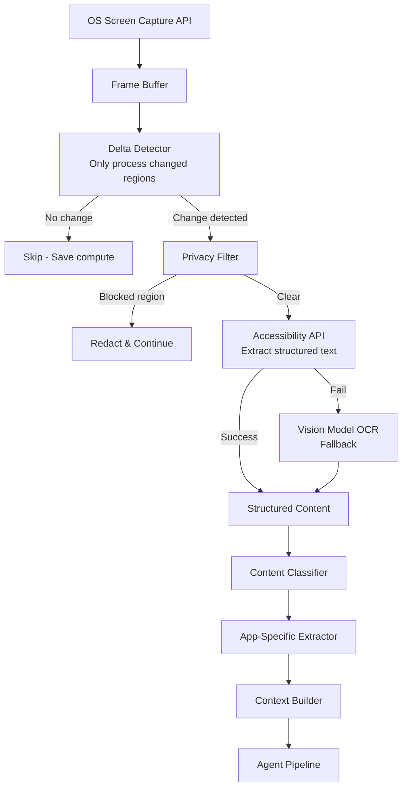

**Capture Specifications:**
```typescript
interface CaptureConfig {
  captureInterval: number;        // milliseconds, default: 2000
  maxResolution: { w: 1920, h: 1080 };
  compressionQuality: 0.7;       // JPEG quality for storage
  deltaThreshold: 0.05;          // % pixels changed to trigger processing
  maxCaptureRate: 5;             // frames per second maximum
  multiMonitor: boolean;         // capture all connected monitors
  excludedApps: string[];        // apps to never capture
  excludedRegions: BoundingBox[]; // screen regions to never capture
  privacyMode: boolean;          // pause all capture
}
```

### 8.2 Privacy Filter

```typescript
class PrivacyFilter {
  private sensitivePatterns = [
    // Passwords
    /password/i, /passwd/i, /secret/i, /api[_\s]?key/i,
    // Financial
    /\b\d{4}[\s-]?\d{4}[\s-]?\d{4}[\s-]?\d{4}\b/, // Credit card
    /\b\d{3}-\d{2}-\d{4}\b/, // SSN
    // Medical
    /diagnosis/i, /prescription/i, /medication/i,
    // Legal  
    /attorney[_\s]client/i, /privileged/i,
  ];
  
  private sensitiveApps = [
    '1Password', 'Bitwarden', 'Keychain Access',
    'Terminal', // when showing credentials
    'Signal', 'WhatsApp', // messaging apps - configurable
  ];
  
  filter(content: ExtractedContent, app: AppType): FilteredContent {
    // Check app blocklist
    if (this.sensitiveApps.includes(app)) {
      return { redacted: true, reason: 'sensitive_app', content: null };
    }
    
    // Redact sensitive patterns
    let filtered = content.text;
    for (const pattern of this.sensitivePatterns) {
      filtered = filtered.replace(pattern, '[REDACTED]');
    }
    
    // Check user-defined exclusion zones
    const cleanedRegions = this.removeExcludedRegions(content);
    
    return { redacted: false, content: cleanedRegions, redactedCount: this.countRedactions(content.text, filtered) };
  }
}
```

### 8.3 App-Specific Content Extractors

#### 8.3.1 Code Editor Extractor (VS Code, Cursor, JetBrains)
```typescript
class CodeEditorExtractor {
  extract(frame: ExtractedContent, accessibility: AccessibilityTree): CodeContext {
    return {
      language: this.detectLanguage(accessibility),
      currentFile: this.getActiveFile(accessibility),
      currentFunction: this.getCurrentFunction(accessibility),
      openFiles: this.getOpenFiles(accessibility),
      errorCount: this.countErrors(accessibility),
      currentErrors: this.getErrors(accessibility),
      recentEdits: this.getRecentChanges(accessibility),
      gitStatus: this.getGitStatus(accessibility),
      testStatus: this.getTestStatus(accessibility),
      debuggerActive: this.isDebuggerActive(accessibility),
      terminalOutput: this.getTerminalOutput(accessibility),
      inferredTask: this.inferTask(accessibility),
      complexity: this.assessComplexity(accessibility),
    };
  }
  
  private inferTask(tree: AccessibilityTree): string {
    // Use patterns to infer what the user is working on
    const activeFile = this.getActiveFile(tree);
    const recentEditLines = this.getRecentChanges(tree);
    const currentFunction = this.getCurrentFunction(tree);
    
    // Use local LLM to classify the task
    return this.localLLM.classify(
      `File: ${activeFile}\nFunction: ${currentFunction}\nRecent edits: ${recentEditLines}`,
      'What is the developer likely trying to accomplish?'
    );
  }
}
```

#### 8.3.2 Research Paper Extractor
```typescript
class ResearchPaperExtractor {
  extract(content: ExtractedContent): ResearchContext {
    return {
      paperTitle: this.extractTitle(content),
      authors: this.extractAuthors(content),
      abstract: this.extractAbstract(content),
      currentSection: this.inferCurrentSection(content),
      scrollPosition: content.scrollPercent,
      highlightedText: this.getHighlightedText(content),
      keyTerms: this.extractKeyTerms(content),
      citationsFound: this.extractCitations(content),
      readingSpeed: this.estimateReadingSpeed(content),
      comprehensionIndicators: this.assessComprehension(content),
      relatedPapers: this.findRelatedInMemory(content),
    };
  }
}
```

#### 8.3.3 Meeting/Video Call Extractor
```typescript
class MeetingExtractor {
  extract(content: ExtractedContent, audio?: AudioStream): MeetingContext {
    return {
      platform: this.detectPlatform(content), // Zoom, Meet, Teams, etc.
      participants: this.extractParticipants(content),
      isSpeaking: this.detectUserSpeaking(audio),
      transcriptFragment: this.getRecentTranscript(audio),
      screenShareActive: this.detectScreenShare(content),
      currentAgenda: this.inferAgenda(content),
      actionItems: this.extractActionItems(content),
      decisions: this.extractDecisions(content),
      meetingDuration: this.getMeetingDuration(content),
    };
  }
}
```

### 8.4 Multi-Monitor Support

```typescript
interface MultiMonitorConfig {
  monitors: MonitorConfig[];
  primaryMonitor: string;
  captureAllMonitors: boolean;
  perMonitorSettings: Record<string, MonitorCaptureSettings>;
}

interface MonitorConfig {
  id: string;
  name: string;
  resolution: { w: number; h: number };
  position: { x: number; y: number };
  scaleFactor: number;
  isPrimary: boolean;
}
```

---

## 9. Camera & Biometric Awareness

### 9.1 Architecture

Camera awareness is **entirely optional**. It is disabled by default. It requires explicit user consent with a clear explanation of what data is collected, how it is used, and how to disable it at any time.

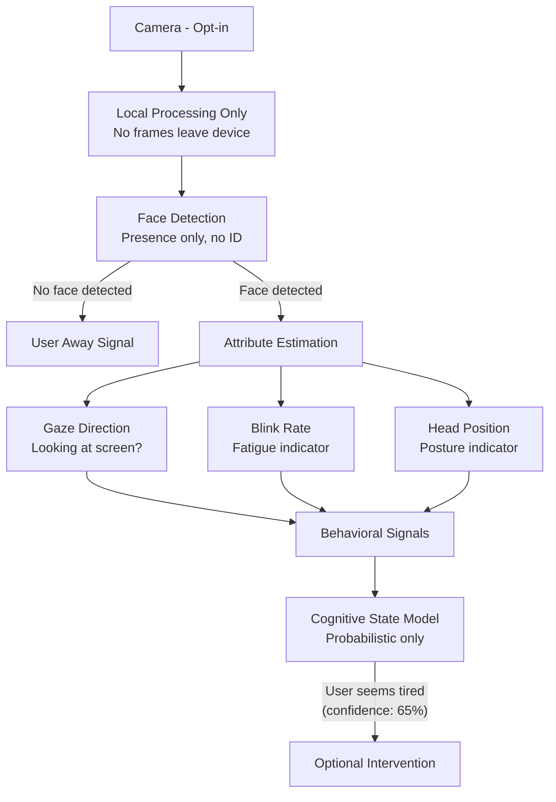

### 9.2 Face Signal Specifications

```typescript
interface FaceSignals {
  faceDetected: boolean;
  lookingAtScreen: boolean;
  lookingAtScreenConfidence: number; // 0-1
  
  // Attention signals
  blinkRatePerMinute: number;     // Normal: 15-20
  blinkRateAnomaly: boolean;      // True if < 8 or > 35
  
  // Fatigue indicators
  eyeOpennessRatio: number;       // 0-1, lower = more tired
  headDropAngle: number;          // degrees from upright
  microNapDetected: boolean;      // head nodding pattern
  
  // Engagement
  facialMuscleActivity: number;   // proxy for engagement
  microExpressionType: null;      // NEVER classify emotions with certainty
  
  // Privacy preservation
  noIdentityExtracted: true;      // Face features never stored
  processingLocation: 'local';    // Always local
  retentionPolicy: 'no_storage';  // Never stored
}
```

**Critical Privacy Note:**
- Raw camera frames are NEVER stored
- Face feature vectors are NEVER stored
- No biometric identifiers are extracted
- All processing is done in real-time, in-memory, on-device
- The camera can be disabled at any time from any screen
- A physical indicator (LED or on-screen overlay) shows when camera is active

### 9.3 Cognitive Signal Inference

```typescript
class CameraSignalProcessor {
  private readonly DISCLAIMER = `
    Camera-based estimates are probabilistic behavioral signals only.
    They are never definitive assessments of mental or emotional states.
    They may be wrong. They are used only to improve assistance timing.
  `;
  
  processSignals(faceSignals: FaceSignals, context: SessionContext): CameraInference {
    const fatigueScore = this.estimateFatigue(faceSignals);
    const attentionScore = this.estimateAttention(faceSignals);
    const engagementScore = this.estimateEngagement(faceSignals, context);
    
    return {
      probablyFatigued: fatigueScore > 0.65,
      probablyDistracted: attentionScore < 0.4,
      probablyEngaged: engagementScore > 0.6,
      confidence: this.computeOverallConfidence(faceSignals),
      signals: {
        blinkRateNormal: faceSignals.blinkRatePerMinute > 8 && faceSignals.blinkRatePerMinute < 35,
        lookingAtScreen: faceSignals.lookingAtScreen,
        eyesOpen: faceSignals.eyeOpennessRatio > 0.6,
        postureGood: faceSignals.headDropAngle < 15,
      },
      disclaimer: this.DISCLAIMER,
    };
  }
  
  private estimateFatigue(signals: FaceSignals): number {
    let score = 0;
    if (signals.blinkRatePerMinute < 8) score += 0.3;  // Eye strain
    if (signals.eyeOpennessRatio < 0.6) score += 0.3;  // Drooping
    if (signals.headDropAngle > 20) score += 0.2;       // Head drop
    if (signals.microNapDetected) score += 0.5;          // Microsleep
    return Math.min(1, score);
  }
}
```

---

## 10. Cognitive State Modeling

### 10.1 State Dimensions

```typescript
interface CognitiveStateSnapshot {
  userId: string;
  timestamp: Date;
  sessionId: string;
  
  // Primary dimensions (0-100)
  focusLevel: number;          // Deep work vs. scattered attention
  engagementLevel: number;     // Active involvement vs. passive
  understandingLevel: number;  // Comprehension of current material
  confusionLevel: number;      // Uncertainty and disorientation
  frustrationLevel: number;    // Blocked, stuck, or irritated
  motivationLevel: number;     // Drive and energy
  mentalFatigue: number;       // Cognitive load saturation
  cognitiveLoad: number;       // Working memory pressure
  
  // Confidence in each estimate
  confidences: Record<CognitiveDimension, number>; // 0-1
  
  // Trend (last 10 minutes)
  trends: Record<CognitiveDimension, 'improving' | 'stable' | 'declining'>;
  
  // Source signals
  sources: CognitiveSignalSources;
  
  // Interpretation
  recommendedAction: CognitiveRecommendation;
  interruptionDesirability: number; // 0-1, higher = more interruptible
}

interface CognitiveSignalSources {
  screenActivity: boolean;
  keyboardActivity: boolean;
  mouseActivity: boolean;
  cameraSignals: boolean;
  sessionDuration: boolean;
  timeOfDay: boolean;
  selfReported: boolean; // user manually set their state
}
```

### 10.2 Signal-to-State Inference

```typescript
class CognitiveStateModel {
  private personalBaseline: PersonalBaseline;
  
  async estimate(signals: RawSignals, context: SessionContext): Promise<CognitiveStateSnapshot> {
    const keyboardPace = this.analyzeKeyboardPace(signals.keystrokeTimings);
    const mousePatterns = this.analyzeMousePatterns(signals.mouseEvents);
    const scrollPatterns = this.analyzeScrollBehavior(signals.scrollEvents);
    const dwellTimes = this.analyzeDwellTimes(signals.pageEvents);
    const appSwitchRate = this.computeAppSwitchRate(signals.windowEvents);
    const sessionDuration = minutesSince(context.sessionStart);
    
    // Focus estimation
    const focusLevel = this.estimateFocus({
      appSwitchRate,      // Fewer switches = more focus
      keyboardPace,       // Consistent pace = focused
      mouseWandering: mousePatterns.wandering,
      dwellTime: dwellTimes.average,
      sessionDuration,
      timeOfDay: signals.timeOfDay,
      baselineFocus: this.personalBaseline.focusPattern,
    });
    
    // Frustration estimation
    const frustrationLevel = this.estimateFrustration({
      deleteToTypeRatio: keyboardPace.deleteRatio,
      rapidMouseClicks: mousePatterns.rapidClicks,
      appSwitchRate,
      errorRate: signals.codeErrors,
      searchQueryCount: signals.searchCount,
      cameraFrustration: signals.camera?.frustrationProxy,
    });
    
    // Mental fatigue estimation
    const mentalFatigue = this.estimateFatigue({
      sessionDuration,
      timeOfDay: signals.timeOfDay,
      taskSwitchFrequency: appSwitchRate,
      keyboardSlowdown: keyboardPace.slowdownRatio,
      cameraFatigue: signals.camera?.fatigueScore,
      breaksSinceStart: signals.breakCount,
    });
    
    return this.assembleSnapshot({
      focusLevel, frustrationLevel, mentalFatigue,
      signals, context
    });
  }
  
  private computeInterruptionDesirability(state: CognitiveStateSnapshot): number {
    // High focus = low desirability to interrupt
    const focusPenalty = state.focusLevel / 100;
    
    // High fatigue = maybe good time for a break suggestion
    const fatigueBonus = state.mentalFatigue > 70 ? 0.4 : 0;
    
    // High frustration = may want help
    const frustrationBonus = state.frustrationLevel > 60 ? 0.3 : 0;
    
    // Confusion = may want explanation
    const confusionBonus = state.confusionLevel > 50 ? 0.2 : 0;
    
    return Math.max(0, Math.min(1,
      (1 - focusPenalty) + fatigueBonus + frustrationBonus + confusionBonus
    ));
  }
}
```

### 10.3 Personal Baseline System

```typescript
interface PersonalBaseline {
  userId: string;
  
  // Typical patterns (learned over 30 days)
  typicalFocusByHour: number[]; // [0-23], focus level for each hour
  typicalProductivityByDayOfWeek: number[]; // [0-6]
  typicalKeyboardWpm: number;
  typicalDeleteRatio: number;
  typicalAppSwitchRatePerHour: number;
  
  // Anomaly thresholds
  focusAnomalyThreshold: number;
  frustrationAnomalyThreshold: number;
  fatigueAnomalyThreshold: number;
  
  // Personal variation ranges
  normalVariance: Record<CognitiveDimension, number>;
  
  updatedAt: Date;
  dataPoints: number; // How many sessions contributed
}
```

### 10.4 Intervention Decision Matrix

```typescript
interface InterventionRule {
  condition: (state: CognitiveStateSnapshot) => boolean;
  action: string;
  priority: number;
  cooldownMinutes: number;
}

const INTERVENTION_RULES: InterventionRule[] = [
  {
    condition: s => s.mentalFatigue > 80 && minutesSinceBreak(s) > 90,
    action: 'suggest_break',
    priority: 85,
    cooldownMinutes: 60,
  },
  {
    condition: s => s.frustrationLevel > 70 && s.sessionDurationMinutes > 10,
    action: 'offer_help',
    priority: 75,
    cooldownMinutes: 15,
  },
  {
    condition: s => s.confusionLevel > 65 && s.contentCategory === 'technical_documentation',
    action: 'offer_explanation',
    priority: 70,
    cooldownMinutes: 5,
  },
  {
    condition: s => s.focusLevel > 90 && s.sessionDurationMinutes > 120,
    action: 'remind_hydration',
    priority: 40,
    cooldownMinutes: 120,
  },
  {
    condition: s => s.motivationLevel < 20 && s.timeOfDay === 'morning',
    action: 'morning_momentum_prompt',
    priority: 60,
    cooldownMinutes: 480,
  },
];
```

---

## 11. Personal Alignment System

### 11.1 Overview

The Personal Alignment System is the continuous learning engine that makes Second Mind increasingly personal over time. It captures explicit preferences, infers implicit preferences from behavior, detects drift, and updates the user preference model in real-time.

### 11.2 User Preference Model

```typescript
interface UserPreferenceModel {
  userId: string;
  version: number;
  lastUpdatedAt: Date;
  
  // Communication preferences
  communication: {
    responseLength: 'very_concise' | 'concise' | 'balanced' | 'detailed' | 'comprehensive';
    technicalDepth: number; // 0-100
    formalityLevel: number; // 0-100 (0=casual, 100=formal)
    useAnalogies: boolean;
    useExamples: boolean;
    useMathematicalFormulas: boolean;
    preferMarkdown: boolean;
    preferBulletLists: boolean;
    languageStyle: 'direct' | 'socratic' | 'narrative' | 'structured';
  };
  
  // Intervention preferences  
  intervention: {
    proactivityLevel: number; // 0-100 (0=silent, 100=very proactive)
    interruptDuringFocus: boolean;
    preferredNotificationStyle: 'popup' | 'widget_pulse' | 'voice' | 'silent_queue';
    quietHoursStart: string; // "22:00"
    quietHoursEnd: string;   // "08:00"
    maxInterventionsPerHour: number;
    batchLowPriorityItems: boolean;
  };
  
  // Teaching preferences
  teaching: {
    preferredStyle: TeachingStyle;
    quizFrequency: 'never' | 'low' | 'medium' | 'high';
    explanationDepth: 'summary' | 'standard' | 'deep_dive';
    useSpacedRepetition: boolean;
    socraticMode: boolean; // ask questions vs. give answers
    showConfidenceScores: boolean;
  };
  
  // Relationship preferences
  relationship: {
    assistantPersonality: 'professional' | 'friendly' | 'mentor' | 'peer' | 'coach';
    humorLevel: number; // 0-100
    empathyExpressionLevel: number; // 0-100
    feedbackDirectness: 'gentle' | 'balanced' | 'direct' | 'blunt';
    celebrateAchievements: boolean;
    acknowledgeFrustrations: boolean;
  };
  
  // Privacy preferences
  privacy: {
    cameraEnabled: boolean;
    screenCaptureEnabled: boolean;
    cloudSyncEnabled: boolean;
    analyticsEnabled: boolean;
    memoryRetentionDays: number; // -1 = forever
    sensitiveAppsBlocked: string[];
    sensitiveDomainsBlocked: string[];
  };
  
  // Goal-related
  goals: {
    showGoalAlignment: boolean;  // show when activity aligns with goals
    goalReminderFrequency: 'daily' | 'weekly' | 'monthly' | 'never';
    proactiveGoalSuggestions: boolean;
    alignmentScoreVisible: boolean;
  };
  
  // Data sources and confidence
  confidences: Record<PreferenceDimension, number>; // 0-1
  explicitOverrides: Record<string, unknown>; // user-set preferences that override inferred
  inferredFrom: Record<PreferenceDimension, string[]>; // evidence for inferred preferences
}
```

### 11.3 Preference Learning Engine

```typescript
class PreferenceLearningEngine {
  // Process explicit feedback
  async processExplicitFeedback(feedback: FeedbackEvent): Promise<void> {
    const preference = this.mapFeedbackToPreference(feedback);
    await this.updatePreference(preference, 'explicit', 1.0); // Full confidence
    await this.propagateToRelatedPreferences(preference);
  }
  
  // Infer preferences from behavior
  async inferFromBehavior(behaviorLog: BehaviorEvent[]): Promise<void> {
    const patterns = this.analyzeBehaviorPatterns(behaviorLog);
    
    for (const pattern of patterns) {
      const impliedPreference = this.interpretPattern(pattern);
      if (impliedPreference && pattern.confidence > 0.6) {
        await this.updatePreference(impliedPreference, 'inferred', pattern.confidence * 0.7);
      }
    }
  }
  
  private analyzeBehaviorPatterns(log: BehaviorEvent[]): BehaviorPattern[] {
    return [
      // If user dismisses every long response, they prefer concise
      this.analyzeResponseLengthPreference(log),
      // If user never expands detailed explanations, they prefer summaries
      this.analyzeDetailPreference(log),
      // If user stops using Teacher Mode quizzes, they don't like quizzes
      this.analyzeTeachingStylePreference(log),
      // If user works until midnight, quiet hours should start later
      this.analyzeWorkingHoursPreference(log),
      // If user dismisses most proactive interventions, lower proactivity
      this.analyzeProactivityPreference(log),
    ];
  }
  
  // Detect preference drift
  async detectDrift(recentBehavior: BehaviorEvent[]): Promise<DriftReport> {
    const currentPreferences = await this.getPreferences();
    const impliedByBehavior = await this.inferFromBehavior(recentBehavior);
    
    const driftScores = this.comparePrefToImplied(currentPreferences, impliedByBehavior);
    const significantDrift = driftScores.filter(d => d.magnitude > 0.3);
    
    if (significantDrift.length > 0) {
      return {
        driftDetected: true,
        dimensions: significantDrift,
        recommendation: this.generateRecalibrationQuestions(significantDrift),
      };
    }
    
    return { driftDetected: false, dimensions: [], recommendation: null };
  }
}
```

### 11.4 Alignment Review Schedule

```typescript
const ALIGNMENT_REVIEW_SCHEDULE = {
  // After every 10 interventions, check: "Am I being useful?"
  postInterventionBatch: {
    triggerCount: 10,
    questions: ['usefulness', 'timing', 'depth'],
  },
  
  // Weekly alignment check-in
  weekly: {
    dayOfWeek: 'sunday',
    time: '18:00',
    duration: '5_minutes',
    areas: ['communication', 'proactivity', 'teaching'],
  },
  
  // Monthly deep alignment session
  monthly: {
    dayOfMonth: 1,
    duration: '15_minutes',
    areas: 'all',
    generateReport: true,
  },
  
  // On explicit request
  onDemand: true,
};
```

---

## 12. Feedback Engine

### 12.1 Feedback Types

```typescript
type FeedbackRequestType =
  | 'was_that_helpful'        // Binary helpfulness
  | 'depth_preference'        // Too shallow / just right / too deep
  | 'timing_preference'       // Too early / right time / too late
  | 'format_preference'       // Preferred output format
  | 'accuracy_check'          // Was the information correct?
  | 'tone_preference'         // Was the tone right?
  | 'open_ended'              // Free-form comment
  | 'intervention_preference' // Should I have said this?
  | 'teaching_effectiveness'; // Was the explanation effective?

interface FeedbackRequest {
  id: string;
  type: FeedbackRequestType;
  triggerInterventionId: string;
  question: string;
  responseOptions?: string[];
  allowFreeText: boolean;
  isRequired: boolean;
  expiresAt: Date;
  displayStyle: 'inline' | 'toast' | 'modal' | 'voice';
}
```

### 12.2 Feedback Question Bank

```typescript
const FEEDBACK_QUESTIONS = {
  was_that_helpful: [
    "Was that useful?",
    "Did that help?",
    "Was that what you needed?",
  ],
  timing_preference: [
    "Good timing, or did I interrupt?",
    "Was that the right moment to mention this?",
    "Should I wait for better moments like this?",
  ],
  depth_preference: [
    "Too much detail, about right, or would you prefer more?",
    "Should I go deeper on topics like this, or keep it brief?",
  ],
  teaching_effectiveness: [
    "Did that explanation click?",
    "Would a different angle help?",
    "Shall I try an example instead?",
  ],
};
```

### 12.3 Feedback Analytics

```typescript
interface FeedbackAnalytics {
  // Response rates
  totalFeedbackRequests: number;
  responseRate: number; // 0-1
  
  // Satisfaction trends
  averageHelpfulness: number; // 0-1
  helpfulnessTrend: 'improving' | 'stable' | 'declining';
  
  // Preference signals
  preferredDepth: 'concise' | 'balanced' | 'detailed';
  preferredTiming: 'proactive' | 'reactive';
  preferredFormat: 'text' | 'bullets' | 'structured';
  
  // Areas for improvement
  mostDismissedInterventionTypes: string[];
  mostRatedHelpfulInterventionTypes: string[];
  
  // By time of day
  helpfulnessByHour: Record<number, number>;
  
  lastUpdated: Date;
}
```

---

## 13. Teacher Mode

### 13.1 Adaptive Learning Architecture

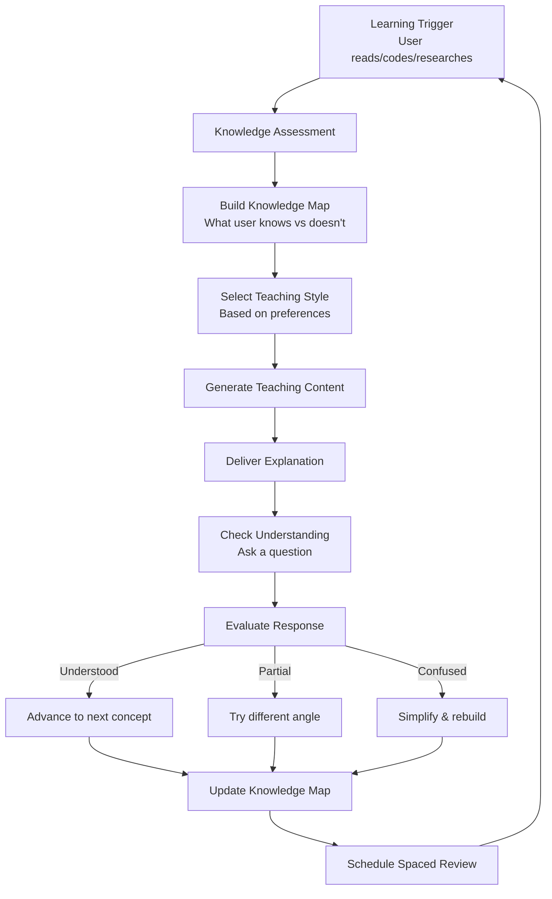

### 13.2 User Knowledge Map

```typescript
interface UserKnowledgeMap {
  userId: string;
  domains: Record<string, DomainKnowledge>;
}

interface DomainKnowledge {
  domain: string;          // 'machine_learning', 'javascript', 'biology', etc.
  overallProficiency: number; // 0-100
  conceptMap: Record<string, ConceptKnowledge>;
  learningPath: LearningPath | null;
  totalStudyMinutes: number;
  lastStudiedAt: Date | null;
  strengthAreas: string[];
  weakAreas: string[];
  nextRecommendedConcepts: string[];
}

interface ConceptKnowledge {
  conceptId: string;
  name: string;
  proficiency: number;     // 0-100
  confidence: number;      // 0-1 (how sure we are of proficiency estimate)
  
  // Spaced repetition
  sm2Data: SM2Data;
  nextReviewAt: Date;
  reviewHistory: ReviewEvent[];
  
  // Learning evidence
  timesExplained: number;
  timesQuizzed: number;
  quizAccuracy: number;    // 0-1
  errorPatterns: string[];
  lastExposureAt: Date;
  
  // Connections
  prerequisitesMastered: boolean;
  unlocksConceptIds: string[];
}
```

### 13.3 Spaced Repetition Engine (SM-2 Algorithm)

```typescript
class SpacedRepetitionEngine {
  // SM-2 Algorithm
  update(sm2: SM2Data, quality: number): SM2Data {
    // quality: 0-5 (0=complete failure, 5=perfect recall)
    
    let { repetitions, easinessFactor, interval } = sm2;
    
    if (quality >= 3) {
      // Successful recall
      if (repetitions === 0) interval = 1;
      else if (repetitions === 1) interval = 6;
      else interval = Math.round(interval * easinessFactor);
      
      repetitions += 1;
    } else {
      // Failed recall - reset
      repetitions = 0;
      interval = 1;
    }
    
    // Update easiness factor
    easinessFactor = Math.max(1.3, 
      easinessFactor + 0.1 - (5 - quality) * (0.08 + (5 - quality) * 0.02)
    );
    
    return {
      repetitions,
      easinessFactor,
      interval,
      nextReviewDate: addDays(new Date(), interval),
      lastQuality: quality,
    };
  }
  
  async getDueReviews(userId: string): Promise<ConceptKnowledge[]> {
    return this.db.query(
      'SELECT * FROM concept_knowledge WHERE user_id = ? AND next_review_at <= ? ORDER BY next_review_at ASC',
      [userId, new Date()]
    );
  }
}
```

### 13.4 Teaching Styles

```typescript
const TEACHING_STYLES = {
  professor: {
    name: 'Professor',
    systemPrompt: `You teach like a university professor: structured, rigorous, comprehensive.
      Start with the theoretical foundation. Use precise terminology.
      Build from first principles. Reference seminal work.
      Challenge the student to think deeply.`,
    characteristics: ['structured', 'rigorous', 'comprehensive', 'theoretical'],
  },
  
  feynman: {
    name: 'Feynman Teacher',
    systemPrompt: `You teach like Richard Feynman: through simplicity, curiosity, and intuition.
      If you can't explain it simply, you don't understand it well enough.
      Find the simplest, clearest explanation possible.
      Use vivid analogies and mental models.
      Make the abstract concrete. Make the complex simple.
      Delight in the beauty of understanding.`,
    characteristics: ['simple', 'intuitive', 'analogies', 'delightful'],
  },
  
  socratic: {
    name: 'Socratic Teacher',
    systemPrompt: `You teach through questions, never giving answers directly.
      Guide the student to discover the answer themselves.
      When they're wrong, ask questions that reveal the error.
      When they're right, ask deeper questions.
      The student should feel they arrived at understanding themselves.`,
    characteristics: ['questioning', 'discovery', 'dialogue', 'self-directed'],
  },
  
  friendly_tutor: {
    name: 'Friendly Tutor',
    systemPrompt: `You're a warm, encouraging tutor who makes learning feel safe and fun.
      Celebrate every bit of progress. Never make the student feel bad for not knowing.
      Use their interests and everyday examples.
      Keep the energy high and the pressure low.
      Learning should feel like play.`,
    characteristics: ['warm', 'encouraging', 'relatable', 'low-pressure'],
  },
  
  coding_mentor: {
    name: 'Coding Mentor',
    systemPrompt: `You teach programming through doing, not theory.
      Show code first, explain after. Use real examples from real codebases.
      Point to patterns, not just syntax. Teach debugging as a skill.
      Connect every concept to practical use.
      "Let me show you how I'd actually approach this."`,
    characteristics: ['practical', 'code-first', 'pattern-focused', 'real-world'],
  },
};
```

### 13.5 Quiz Engine

```typescript
class QuizEngine {
  async generateQuiz(
    concept: ConceptKnowledge,
    style: QuizStyle,
    difficulty: 'beginner' | 'intermediate' | 'advanced'
  ): Promise<Quiz> {
    const questionTypes = this.selectQuestionTypes(concept, style);
    const questions = await Promise.all(
      questionTypes.map(type => this.generateQuestion(concept, type, difficulty))
    );
    
    return {
      id: generateId(),
      conceptId: concept.conceptId,
      questions,
      style,
      difficulty,
      estimatedMinutes: questions.length * 2,
      createdAt: new Date(),
    };
  }
  
  async evaluateAnswer(
    question: QuizQuestion,
    userAnswer: string,
    context: SessionContext
  ): Promise<QuizEvaluation> {
    // Use LLM to evaluate (semantic matching, not exact string matching)
    const evaluation = await this.llm.evaluate({
      question: question.text,
      correctAnswer: question.correctAnswer,
      userAnswer,
      rubric: question.rubric,
    });
    
    // Update SM-2 data
    const quality = this.mapScoreToSM2Quality(evaluation.score);
    
    return {
      score: evaluation.score,
      isCorrect: evaluation.score >= 0.7,
      feedback: evaluation.feedback,
      correctAnswer: evaluation.score < 0.7 ? question.correctAnswer : null,
      explanation: evaluation.explanation,
      sm2Quality: quality,
      followUpQuestion: evaluation.score < 0.5 ? await this.generateFollowUp(question) : null,
    };
  }
}

type QuizStyle = 'multiple_choice' | 'free_recall' | 'fill_blank' | 'explain_concept' | 'apply_to_scenario' | 'debug_code' | 'spot_the_error';
```

### 13.6 Learning Progress Tracking

```typescript
interface LearningProgress {
  userId: string;
  domain: string;
  period: 'day' | 'week' | 'month' | 'all_time';
  
  // Volume metrics
  minutesStudied: number;
  conceptsEncountered: number;
  conceptsMastered: number; // proficiency > 80
  quizzesTaken: number;
  quizAccuracy: number; // 0-1
  
  // Quality metrics
  averageProficiencyGain: number;
  retentionRate: number; // % of reviewed concepts still retained
  learningVelocity: number; // concepts mastered per hour
  
  // Spaced repetition health
  reviewsDue: number;
  reviewsCompleted: number;
  overdueReviews: number;
  
  // Strengths and gaps
  masteredConcepts: string[];
  weakConcepts: string[];
  recommendedNextConcepts: string[];
  
  // Comparative
  vsLastPeriod: number; // % change
  vsGoal: number; // % of learning goal achieved
}
```

---

## 14. Life Management System

### 14.1 Life Areas

```typescript
type LifeArea =
  | 'career'        | 'learning'      | 'health'
  | 'relationships' | 'finances'      | 'personal_growth'
  | 'creativity'    | 'spirituality'  | 'recreation'
  | 'family'        | 'community'     | 'environment';

interface LifeAreaAssessment {
  area: LifeArea;
  currentScore: number;    // 0-100 (user-rated or inferred)
  targetScore: number;     // user's desired score
  trend: 'improving' | 'stable' | 'declining';
  lastAssessedAt: Date;
  activeGoals: Goal[];
  activeHabits: Habit[];
  recentWins: string[];
  currentChallenges: string[];
  nextAction: string;
}
```

### 14.2 Habit System

```typescript
interface Habit {
  id: string;
  userId: string;
  name: string;
  description: string;
  category: HabitCategory;
  
  // Habit design (Atomic Habits framework)
  cue: string;           // What triggers it
  routine: string;       // What they do
  reward: string;        // What makes it satisfying
  environment: string;   // Environmental design notes
  
  // Scheduling
  targetFrequency: 'daily' | 'weekdays' | 'specific_days' | 'weekly';
  targetDays?: number[]; // 0-6 for specific_days
  targetTime?: string;   // "07:00" optional
  targetDurationMinutes?: number;
  
  // Tracking
  currentStreak: number;
  longestStreak: number;
  totalCompletions: number;
  completionRate7d: number;
  completionRate30d: number;
  completionRate90d: number;
  
  // Relationships
  parentGoalIds: string[];
  stackedWithHabitId: string | null; // habit stacking
  
  // Status
  isActive: boolean;
  startedAt: Date;
  pausedAt: Date | null;
  completedAt: Date | null;
  
  createdAt: Date;
  updatedAt: Date;
}

interface HabitCompletion {
  id: string;
  habitId: string;
  userId: string;
  completedAt: Date;
  durationMinutes: number | null;
  quality: number | null; // 1-5 user rating
  notes: string | null;
  mood: number | null; // 1-5
  energyLevel: number | null; // 1-5
}
```

### 14.3 Daily Dashboard Data

```typescript
interface DailyDashboardData {
  date: Date;
  userId: string;
  
  // Morning summary
  morningBriefing: {
    greeting: string;
    topPriorities: string[];
    todayGoalFocus: string;
    habitsDueToday: Habit[];
    upcomingCommitments: Commitment[];
    weatherSummary?: string;
    motivationalNote: string;
  };
  
  // Real-time metrics
  currentCognitiveState: CognitiveStateSnapshot;
  productiveMinutesToday: number;
  deepWorkMinutesToday: number;
  habitsCompletedToday: number;
  habitsRemainingToday: number;
  
  // Goal progress
  activeGoalProgress: GoalProgressSummary[];
  
  // Learning
  conceptsStudiedToday: string[];
  minutesLearningToday: number;
  reviewsDueToday: number;
  
  // Health
  exerciseCompletedToday: boolean;
  meditationCompletedToday: boolean;
  hoursSleptLastNight: number | null;
  
  // Relationships
  followUpsToday: Commitment[];
  birthdays: PersonNode[];
  
  // End of day (populated at EOD)
  eveningReview?: EveningReview;
}
```

---

## 15. Relationship Intelligence

### 15.1 Relationship Graph

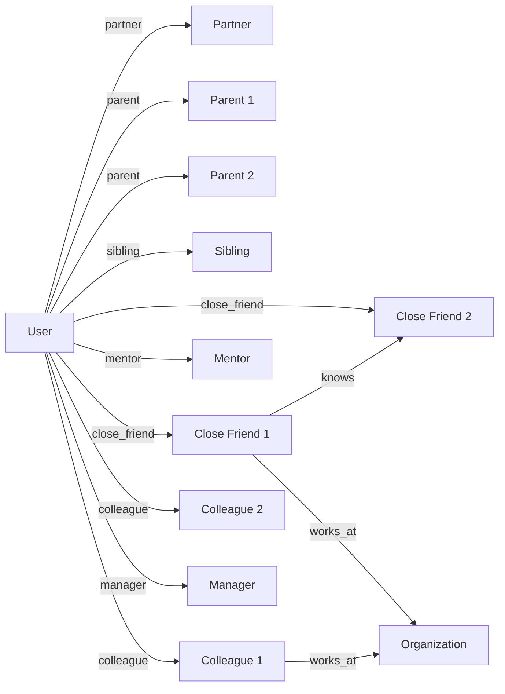

### 15.2 Person Schema

```typescript
interface Person {
  id: string;
  userId: string;
  
  // Identity
  name: string;
  nickname: string | null;
  pronouns: string | null;
  
  // Relationship
  relationshipType: RelationshipType;
  closenessLevel: number; // 0-100
  trustLevel: number;     // 0-100
  
  // Contact
  email: string | null;
  phone: string | null;
  linkedinUrl: string | null;
  
  // Demographics (if shared)
  birthday: Date | null;
  location: string | null;
  occupation: string | null;
  organization: string | null;
  
  // Personality and style notes
  personalityNotes: string;
  communicationStyle: string;
  interests: string[];
  values: string[];
  
  // Interaction tracking
  lastInteractionAt: Date | null;
  lastInteractionType: InteractionType | null;
  interactionFrequencyTarget: 'daily' | 'weekly' | 'monthly' | 'quarterly' | 'as_needed';
  interactionFrequencyActual: number; // times per month average
  
  // Important dates
  importantDates: ImportantDate[];
  
  // Memory
  sharedHistory: string;
  importantFacts: string[];
  currentSituationSummary: string;
  lastUpdatedSummaryAt: Date;
  
  // Relationship health
  relationshipHealthScore: number; // 0-100
  lastHealthAssessedAt: Date;
  currentTopics: string[];   // what's going on in their life
  
  // Status
  isActive: boolean;
  createdAt: Date;
  updatedAt: Date;
}

type RelationshipType =
  | 'partner' | 'spouse' | 'parent' | 'child' | 'sibling' | 'grandparent'
  | 'close_friend' | 'friend' | 'acquaintance' | 'colleague' | 'manager'
  | 'direct_report' | 'mentor' | 'mentee' | 'collaborator' | 'advisor'
  | 'client' | 'vendor' | 'neighbor' | 'community_member';

interface ImportantDate {
  date: Date;
  isRecurring: boolean;
  description: string;
  reminderDaysBefore: number;
  category: 'birthday' | 'anniversary' | 'graduation' | 'other';
}
```

### 15.3 Commitment Tracking

```typescript
interface Commitment {
  id: string;
  userId: string;
  
  // Parties
  madeByUserId: string | null;   // null if made by the other person
  madeToPersonId: string;
  
  // Content
  description: string;
  context: string;               // what conversation it arose from
  
  // Timing
  madeAt: Date;
  dueAt: Date | null;
  completedAt: Date | null;
  
  // Status
  status: 'pending' | 'completed' | 'overdue' | 'cancelled';
  priority: 'low' | 'medium' | 'high' | 'critical';
  
  // Reminders
  reminderAt: Date | null;
  reminderSent: boolean;
  
  // Source
  detectedFromScreen: boolean;   // auto-detected from meeting/message
  userConfirmed: boolean;        // user confirmed this is accurate
  
  notes: string;
  createdAt: Date;
  updatedAt: Date;
}
```

### 15.4 Relationship Insights Engine

```typescript
class RelationshipInsightsEngine {
  async generateInsights(personId: string, userId: string): Promise<RelationshipInsights> {
    const person = await this.getPerson(personId);
    const interactions = await this.getRecentInteractions(personId, 90);
    const commitments = await this.getCommitments(personId);
    const memories = await this.getRelationshipMemories(personId);
    
    return {
      // Health assessment
      relationshipHealth: this.assessHealth(person, interactions),
      healthTrend: this.computeHealthTrend(interactions),
      
      // Action items
      overdueCommitments: commitments.filter(c => c.status === 'overdue'),
      upcomingCommitments: commitments.filter(c => c.status === 'pending' && isThisWeek(c.dueAt)),
      upcomingImportantDates: this.getUpcomingDates(person, 30),
      
      // Frequency check
      lastContactDaysAgo: daysSince(person.lastInteractionAt),
      isOverdue: this.isContactOverdue(person),
      suggestedReachOutBy: this.computeSuggestedReachOut(person),
      
      // Conversation starters
      conversationStarters: await this.generateConversationStarters(person, memories),
      
      // Relationship growth
      depthTrend: this.analyzeDepthTrend(interactions),
      sharedTopics: this.findSharedTopics(interactions),
      mutualGoals: this.findMutualGoals(person),
    };
  }
  
  private isContactOverdue(person: Person): boolean {
    if (!person.lastInteractionAt) return true;
    const daysSinceLast = daysSince(person.lastInteractionAt);
    const targetFrequency = {
      daily: 2, weekly: 10, monthly: 45, quarterly: 100, as_needed: 365
    };
    return daysSinceLast > targetFrequency[person.interactionFrequencyTarget];
  }
  
  private async generateConversationStarters(
    person: Person, memories: RelationshipMemory[]
  ): Promise<string[]> {
    const recentEvents = memories
      .filter(m => daysSince(m.createdAt) < 30)
      .map(m => m.content);
    
    return this.llm.generate(`
      Generate 3 genuine, specific conversation starters to reconnect with ${person.name}.
      
      What we know about them: ${person.currentSituationSummary}
      Recent topics: ${person.currentTopics.join(', ')}
      Recent events: ${recentEvents.join('\n')}
      
      Make them feel natural and specific, not generic.
    `);
  }
}
```

### 15.5 Conversation Context Detection

When the screen shows a messaging app, email client, or video call, Second Mind can:
1. Detect who the user is communicating with (from People database)
2. Surface relevant context from the relationship memory
3. Show pending commitments and follow-ups
4. Provide communication style hints based on relationship notes

---

## 16. Health & Wellbeing System

### 16.1 Health Profile

```typescript
interface HealthProfile {
  userId: string;
  
  // Goals
  sleepGoalHours: number;
  exerciseGoalMinutesPerWeek: number;
  meditationGoalMinutesPerDay: number;
  stepsGoalPerDay: number;
  waterGoalOz: number;
  
  // Baseline (self-reported)
  typicalSleepHours: number;
  currentFitnessLevel: 'sedentary' | 'light' | 'moderate' | 'active' | 'very_active';
  meditationExperience: 'none' | 'beginner' | 'intermediate' | 'advanced';
  
  // Integrations
  connectedApps: HealthAppIntegration[];
  
  // Privacy
  trackSleepData: boolean;
  trackExerciseData: boolean;
  trackMoodData: boolean;
}

interface HealthAppIntegration {
  app: 'apple_health' | 'google_fit' | 'fitbit' | 'oura' | 'garmin' | 'whoop';
  connected: boolean;
  permissions: string[];
  lastSyncAt: Date | null;
}
```

### 16.2 Daily Health Data

```typescript
interface DailyHealthData {
  date: Date;
  userId: string;
  
  // Sleep (from wearable or manual)
  sleepHours: number | null;
  sleepQuality: number | null; // 0-100
  bedtime: Date | null;
  wakeTime: Date | null;
  
  // Activity
  stepsCount: number | null;
  exerciseMinutes: number | null;
  exerciseType: string | null;
  caloriesBurned: number | null;
  
  // Mental health
  meditationMinutes: number | null;
  moodRating: number | null; // 1-10
  energyLevel: number | null; // 1-10
  stressLevel: number | null; // 1-10
  
  // Focus
  deepWorkMinutes: number;  // from screen tracking
  breakCount: number;
  longestFocusSession: number; // minutes
  
  // Hydration (manual)
  waterOz: number | null;
  
  // Derived
  wellbeingScore: number; // computed composite 0-100
  recoveryScore: number | null; // from wearable
}
```

### 16.3 Wellbeing Intervention Types

```typescript
type WellbeingIntervention =
  | 'break_reminder'       // "You've been at it for 90 min. Quick break?"
  | 'movement_prompt'      // "Haven't moved in 2 hours. 5-min walk?"
  | 'hydration_reminder'   // "Reminder to drink water."
  | 'sleep_wind_down'      // "It's 10pm — time to wind down?"
  | 'meditation_prompt'    // "You seem stressed. 5-min meditation?"
  | 'breathing_exercise'   // "Quick box breathing to reset focus."
  | 'eye_rest'             // "20-20-20 rule: look 20ft away for 20s."
  | 'posture_check'        // "Check your posture."
  | 'positive_reflection'  // "You've been focused 3hrs. Great work."
  | 'end_of_day_wrap';     // "Good stopping point. Review your day?"
```

### 16.4 Mental Health Indicators

```typescript
interface MentalHealthIndicators {
  // DISCLAIMER: These are behavioral observations, not clinical assessments
  // Second Mind is NOT a medical device and does NOT diagnose conditions
  
  stressIndicators: {
    highFrustrationFrequency: boolean;
    reducedProductivity: boolean;
    increasedErrorRate: boolean;
    erraticWorkPatterns: boolean;
    confidence: 'low'; // Always low — we cannot assess clinical stress
  };
  
  burnoutWarnings: {
    consistentlyLowMotivation: boolean;
    decliningEngagement: boolean;
    reducedLearningActivity: boolean;
    increasedIdleTime: boolean;
    confidence: 'low';
  };
  
  // If concerning patterns detected, prompt professional help
  shouldSuggestProfessionalSupport: boolean;
  professionalSupportMessage: string | null;
}
```

---

## 17. Goal Alignment Engine

### 17.1 Goal Schema

```typescript
interface Goal {
  id: string;
  userId: string;
  
  // Content
  title: string;
  description: string;
  whyItMatters: string;    // Simon Sinek's "Start with Why"
  vision: string;          // What life looks like when achieved
  
  // Hierarchy
  type: 'lifetime' | 'annual' | 'quarterly' | 'monthly' | 'weekly' | 'project';
  parentGoalId: string | null;
  childGoalIds: string[];
  
  // Category
  category: GoalCategory;
  
  // Measurability (OKR-style)
  successCriteria: string[];
  metrics: GoalMetric[];
  
  // Timeline
  startDate: Date;
  targetDate: Date | null;
  completedAt: Date | null;
  
  // Progress
  progressPercent: number; // 0-100
  lastProgressUpdateAt: Date;
  
  // Status
  status: 'draft' | 'active' | 'paused' | 'completed' | 'abandoned';
  priority: 1 | 2 | 3 | 4 | 5; // 1 = highest
  
  // Alignment
  alignedHabitIds: string[];
  alignedProjectIds: string[];
  alignedSkillIds: string[];
  requiredPersonIds: string[]; // people needed to achieve this
  
  // Review
  reviewFrequency: 'daily' | 'weekly' | 'monthly';
  lastReviewedAt: Date;
  
  // Metadata
  createdAt: Date;
  updatedAt: Date;
  isArchived: boolean;
}

type GoalCategory =
  | 'career' | 'learning' | 'health' | 'relationships'
  | 'financial' | 'creative' | 'personal_growth' | 'spiritual'
  | 'family' | 'community' | 'environmental' | 'fun';

interface GoalMetric {
  id: string;
  goalId: string;
  name: string;
  unit: string;
  currentValue: number;
  targetValue: number;
  startValue: number;
  measurementFrequency: 'daily' | 'weekly' | 'monthly';
  lastMeasuredAt: Date;
  history: MetricSnapshot[];
}
```

### 17.2 Goal Alignment Score

```typescript
interface GoalAlignmentScore {
  overallScore: number; // 0-100
  breakdown: {
    timeAllocation: number;    // % of time spent on goal-related activities
    habitAlignment: number;    // % of active habits supporting goals
    learningAlignment: number; // % of learning aligned with goals
    projectAlignment: number;  // % of projects supporting goals
    relationshipAlignment: number;
  };
  misalignedActivities: MisalignedActivity[];
  opportunitiesForBetterAlignment: string[];
  calculatedAt: Date;
}

interface MisalignedActivity {
  activity: string;
  timeSpentMinutes: number;
  percentOfDay: number;
  suggestedReduction: string;
  goalOpportunityCost: string;
}
```

### 17.3 Goal Alignment Engine

```typescript
class GoalAlignmentEngine {
  async evaluateAlignment(
    recentActivity: ActivitySummary[],
    activeGoals: Goal[]
  ): Promise<GoalAlignmentScore> {
    // Map activities to goals
    const activityGoalMap = await this.mapActivitiesToGoals(recentActivity, activeGoals);
    
    // Compute time allocation score
    const goalAlignedTime = this.sumGoalAlignedTime(activityGoalMap);
    const totalTime = this.sumTotalTime(recentActivity);
    const timeAllocation = (goalAlignedTime / totalTime) * 100;
    
    // Find misaligned activities (time spent on non-goal activities)
    const misaligned = this.findMisalignedActivities(activityGoalMap);
    
    // Generate opportunities
    const opportunities = await this.generateAlignmentOpportunities(activeGoals, activityGoalMap);
    
    return {
      overallScore: Math.round(timeAllocation),
      breakdown: this.computeBreakdown(activityGoalMap, activeGoals),
      misalignedActivities: misaligned,
      opportunitiesForBetterAlignment: opportunities,
      calculatedAt: new Date(),
    };
  }
  
  async checkActivityAlignment(
    activity: ObservedContext,
    goals: Goal[]
  ): Promise<ActivityAlignmentResult> {
    // Called in real-time for each observed activity
    const embedding = await this.embed(JSON.stringify(activity));
    const goalEmbeddings = await Promise.all(goals.map(g => this.embed(g.title + ' ' + g.description)));
    
    const similarities = goalEmbeddings.map((ge, i) => ({
      goal: goals[i],
      similarity: cosineSimilarity(embedding, ge)
    }));
    
    const bestMatch = similarities.sort((a, b) => b.similarity - a.similarity)[0];
    
    return {
      isAligned: bestMatch.similarity > 0.6,
      alignedGoal: bestMatch.similarity > 0.6 ? bestMatch.goal : null,
      alignmentScore: bestMatch.similarity,
      shouldNotifyUser: bestMatch.similarity > 0.85 && this.userWantsAlignmentNotifications(),
    };
  }
}
```

---

## 18. Proactive Assistance Engine

### 18.1 Prediction Types

```typescript
type PredictionType =
  | 'likely_next_question'   // User will probably want to know X
  | 'likely_blocker'         // User is about to hit a wall
  | 'likely_mistake'         // User is about to make an error
  | 'likely_need'            // User will need resource/tool X
  | 'likely_distraction'     // User is drifting off-task
  | 'learning_opportunity'   // Great moment to teach concept X
  | 'reflection_opportunity' // Good moment for a quick reflection
  | 'relationship_action'    // Follow-up with person X is overdue
  | 'habit_cue'              // Habit trigger detected
  | 'goal_opportunity'       // Current context connects to goal X
  | 'energy_management';     // Break/rest signal

interface Prediction {
  id: string;
  type: PredictionType;
  confidence: number; // 0-1
  urgency: number;    // 0-100
  value: number;      // 0-100 (estimated user value)
  context: string;
  suggestedIntervention: InterventionCandidate;
  expiresAt: Date;
  createdAt: Date;
}
```

### 18.2 Intervention Timing Engine

```typescript
class InterventionTimingEngine {
  private readonly MIN_INTERVAL_MINUTES = 3;
  private readonly FOCUS_PROTECTION_THRESHOLD = 0.85;
  
  async shouldIntervene(
    candidate: InterventionCandidate,
    state: CognitiveStateSnapshot,
    preferences: UserPreferenceModel,
    recentHistory: Intervention[]
  ): Promise<InterventionDecision> {
    
    // Hard blocks
    if (preferences.intervention.quietHoursActive) {
      return { shouldIntervene: false, reason: 'quiet_hours', delayUntil: this.quietHoursEnd(preferences) };
    }
    
    if (state.focusLevel > this.FOCUS_PROTECTION_THRESHOLD && !candidate.isUrgent) {
      return { shouldIntervene: false, reason: 'deep_focus', delayUntil: this.estimateFocusBreak(state) };
    }
    
    const minutesSinceLast = this.minutesSinceLastIntervention(recentHistory);
    if (minutesSinceLast < this.MIN_INTERVAL_MINUTES) {
      return { shouldIntervene: false, reason: 'too_recent', delayUntil: addMinutes(new Date(), this.MIN_INTERVAL_MINUTES - minutesSinceLast) };
    }
    
    // Score the intervention
    const score = this.scoreIntervention(candidate, state, preferences);
    
    if (score < 40) {
      return { shouldIntervene: false, reason: 'low_value', delayUntil: null };
    }
    
    return {
      shouldIntervene: true,
      reason: 'high_value_right_moment',
      score,
      delayUntil: null,
    };
  }
}
```

### 18.3 Example Interventions

```typescript
const EXAMPLE_INTERVENTIONS = [
  {
    trigger: 'User is reading Python docs on decorators and has previously struggled with closures',
    intervention: 'Quick connection: Decorators use closures internally — want me to show how they\'re related? It might make decorators click.',
    type: 'learning_opportunity',
    timing: 'after_natural_pause',
  },
  {
    trigger: 'User is in a video call and there\'s a commitment being made',
    intervention: '[Silent] Auto-capture: "David said he\'d send the proposal by Thursday." — Added to commitments.',
    type: 'commitment_capture',
    timing: 'immediate_silent',
  },
  {
    trigger: 'User has been working for 95 minutes without a break, fatigue score rising',
    intervention: '95 minutes in — your best thinking usually happens after a short break. 5 minutes?',
    type: 'energy_management',
    timing: 'at_natural_transition',
  },
  {
    trigger: 'User writes a bug that Second Mind can predict will cause an issue',
    intervention: 'Notice: that list index could throw IndexError if the list is empty. Want me to show a safe pattern?',
    type: 'likely_mistake',
    timing: 'immediately',
  },
];
```

---

## 19. Friend Mode & Personality Architecture

### 19.1 Personality Profile

```typescript
interface PersonalityProfile {
  // Core traits (configurable by user, defaults below)
  warmth: number;        // 0-100, default: 75
  humor: number;         // 0-100, default: 50
  directness: number;    // 0-100, default: 65
  curiosity: number;     // 0-100, default: 80
  empathy: number;       // 0-100, default: 75
  encouragement: number; // 0-100, default: 70
  formality: number;     // 0-100, default: 35 (fairly casual)
  
  // Role emphasis
  primaryRole: 'friend' | 'mentor' | 'coach' | 'teacher' | 'professional';
  
  // Communication style
  usesHumor: boolean;
  usesEmoji: boolean;        // default: false
  usesCasualLanguage: boolean; // default: true
  
  // Adaptations (auto-updated based on feedback)
  adaptations: PersonalityAdaptation[];
  lastAdaptedAt: Date;
}

interface PersonalityAdaptation {
  dimension: string;
  adjustment: number;    // delta applied
  reason: string;
  evidenceCount: number;
  appliedAt: Date;
}
```

### 19.2 Emotional Context Model

```typescript
interface EmotionalContext {
  // Inferred from behavioral signals (with low confidence)
  inferredMood: 'positive' | 'neutral' | 'stressed' | 'frustrated' | 'excited' | 'tired';
  moodConfidence: number; // 0-1, typically low
  
  // User-reported (high confidence)
  selfReportedMood: number | null; // 1-10
  selfReportedAt: Date | null;
  
  // Session emotional trajectory
  moodTrend: 'improving' | 'stable' | 'declining';
  
  // Event context
  recentPositiveEvents: string[];
  recentStressors: string[];
  
  // Response modifiers
  shouldUseSofterTone: boolean;
  shouldAcknowledgeDifficulty: boolean;
  shouldCelebrate: boolean;
  shouldOfferSupport: boolean;
}
```

### 19.3 Conversation Guidelines

```typescript
const FRIEND_MODE_GUIDELINES = {
  doAlways: [
    'Listen more than you speak',
    'Acknowledge feelings before offering solutions',
    'Be genuinely curious about the user as a whole person',
    'Celebrate wins, however small',
    'Be honest even when it\'s uncomfortable',
    'Trust the user\'s intelligence and autonomy',
    'Remember what matters to them and bring it up naturally',
  ],
  
  doNever: [
    'Be sycophantic or hollow',
    'Agree with everything the user says',
    'Use manipulative language patterns',
    'Create dependency or imply the user needs you',
    'Give unsolicited advice about deeply personal matters',
    'Moralize or lecture',
    'Catastrophize or minimize',
    'Pretend to feel things you don\'t',
    'Encourage the user to rely on Second Mind over real human relationships',
  ],
  
  onEmotionalDifficulty: [
    'Acknowledge what they\'re going through',
    'Validate the feeling (not necessarily the interpretation)',
    'Ask what kind of support they want',
    'Offer concrete help if appropriate',
    'Know when to suggest professional support',
    'Never attempt to be a therapist',
  ],
};
```

### 19.4 Tone Library

```typescript
const TONE_EXAMPLES = {
  celebration: [
    "That's genuinely impressive — you shipped that in half the time you expected.",
    "You cracked something hard there. Take a moment with that.",
    "Two weeks ago this concept was confusing you. Today you're explaining it. That's real growth.",
  ],
  
  gentle_challenge: [
    "I notice you've been stuck on this for a while. Sometimes a fresh angle helps — want to try approaching it from the user's perspective instead?",
    "This approach will work, though there might be a cleaner path. Interested in exploring it?",
  ],
  
  empathy_without_enabling: [
    "That sounds genuinely frustrating — especially after how much work you put into it.",
    "I hear you. That's a hard situation. What feels most pressing right now?",
  ],
  
  honest_feedback: [
    "Straight answer: this code will work but it'll hurt you later. Want me to walk through why?",
    "I want to be honest with you — I'm not sure this approach matches what you're trying to achieve with this goal.",
  ],
  
  encouraging_accountability: [
    "Yesterday you set the intention to finish this section. How's it going?",
    "You've pushed this back a few times. Is there something making it harder than expected?",
  ],
};
```

---

## 20. Voice System

### 20.1 Voice Pipeline Architecture

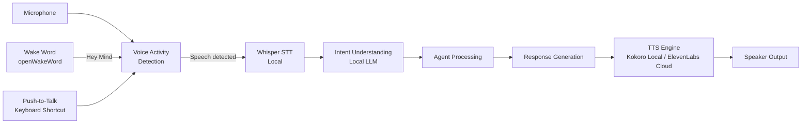

### 20.2 Voice Modes

```typescript
type VoiceMode =
  | 'push_to_talk'       // Hold key to speak
  | 'wake_word'          // "Hey Mind" activation
  | 'continuous'         // Always listening (explicit opt-in)
  | 'muted';             // Voice completely disabled

interface VoiceConfig {
  mode: VoiceMode;
  wakeWord: WakeWordConfig;
  pushToTalkKey: string; // e.g., 'Ctrl+Shift+Space'
  outputMode: 'voice' | 'text' | 'both';
  persona: VoicePersona;
  speed: number; // 0.5-2.0
  localTTS: boolean; // default true
  cloudTTSProvider: 'elevenlabs' | 'openai' | null;
}

interface WakeWordConfig {
  keyword: 'hey mind' | 'second mind' | string; // custom
  sensitivity: number; // 0-1, higher = more sensitive (more false positives)
  requiresConfirmationBeep: boolean;
  activationIndicator: 'visual' | 'audio' | 'both';
}
```

### 20.3 Voice Personas

```typescript
interface VoicePersona {
  id: string;
  name: string;
  description: string;
  voiceCharacteristics: string;
  personalityTraits: string[];
  samplePhrases: string[];
  
  // TTS configuration
  localVoiceId: string;   // Kokoro voice
  cloudVoiceId: string;   // ElevenLabs voice ID
}

const BUILT_IN_PERSONAS: VoicePersona[] = [
  {
    id: 'sage',
    name: 'Sage',
    description: 'Calm, thoughtful, mentor-like',
    voiceCharacteristics: 'Deep, measured, warm baritone',
    personalityTraits: ['patient', 'wise', 'encouraging', 'clear'],
    samplePhrases: [
      "Here's something worth considering...",
      "Based on what you've shared, I think...",
    ],
    localVoiceId: 'kokoro_en_m_deep',
    cloudVoiceId: 'eLjl5HvF7gMkAvXXBYhS', // Example
  },
  {
    id: 'aria',
    name: 'Aria',
    description: 'Energetic, friendly, peer-like',
    voiceCharacteristics: 'Warm, bright, approachable',
    personalityTraits: ['enthusiastic', 'supportive', 'casual', 'fun'],
    samplePhrases: [
      "Oh, interesting — I noticed something...",
      "Quick thought while you're working on this...",
    ],
    localVoiceId: 'kokoro_en_f_bright',
    cloudVoiceId: 'pNInz6obpgDQGcFmaJgB',
  },
];
```

### 20.4 Continuous Conversation Mode

```typescript
class ContinuousConversationManager {
  private turnHistory: ConversationTurn[] = [];
  private maxTurns: number = 20;
  
  async processTurn(userSpeech: string, context: SessionContext): Promise<ConversationTurn> {
    // Add to history
    const userTurn: ConversationTurn = {
      role: 'user',
      content: userSpeech,
      timestamp: new Date(),
    };
    this.turnHistory.push(userTurn);
    
    // Build messages array with history + context
    const messages = [
      { role: 'system', content: this.buildSystemPrompt(context) },
      ...this.turnHistory.map(t => ({ role: t.role, content: t.content })),
    ];
    
    // Generate response
    const response = await this.llm.chat(messages);
    
    const assistantTurn: ConversationTurn = {
      role: 'assistant',
      content: response,
      timestamp: new Date(),
    };
    this.turnHistory.push(assistantTurn);
    
    // Trim to max turns
    if (this.turnHistory.length > this.maxTurns * 2) {
      this.turnHistory = this.summarizeAndTrim(this.turnHistory);
    }
    
    return assistantTurn;
  }
}
```

---

## 21. Reflection Engine

### 21.1 Daily Reflection

```typescript
interface DailyReflection {
  id: string;
  userId: string;
  date: Date;
  
  // Auto-generated summary
  dayInReview: string;
  topActivities: ActivitySummary[];
  deepWorkMinutes: number;
  learningHighlights: string[];
  
  // Goal alignment
  goalAlignmentScore: number;
  goalProgressToday: GoalProgressSummary[];
  
  // Habit tracking
  habitsCompleted: string[];
  habitsMissed: string[];
  habitCompletionRate: number;
  
  // Health metrics
  healthData: DailyHealthData;
  wellbeingScore: number;
  
  // Relationship actions
  relationshipInteractions: string[];
  commitmentsCompleted: string[];
  pendingFollowUps: string[];
  
  // Insights (AI generated)
  keyInsights: string[];
  celebrationNote: string;
  tomorrowSuggestion: string;
  
  // User input
  userReflectionNote: string | null;
  energyRating: number | null; // 1-5
  moodRating: number | null;   // 1-5
  
  generatedAt: Date;
  userViewedAt: Date | null;
}
```

### 21.2 Weekly Review

```typescript
interface WeeklyReview {
  id: string;
  userId: string;
  weekStartDate: Date;
  weekEndDate: Date;
  
  // Performance overview
  productiveHours: number;
  deepWorkHours: number;
  vsLastWeek: {
    productiveHours: number;
    deepWorkHours: number;
    habitCompletion: number;
  };
  
  // Learning
  conceptsMastered: string[];
  skillsImproved: string[];
  studyHours: number;
  reviewsCompleted: number;
  
  // Goals
  weeklyGoalsAchieved: string[];
  weeklyGoalsMissed: string[];
  progressTowardAnnualGoals: GoalProgressSummary[];
  
  // Habits
  overallHabitScore: number; // % of habit completions
  streakHighlights: string[];
  habitBreaks: string[];
  
  // Health
  averageSleepHours: number;
  exerciseSessions: number;
  meditationSessions: number;
  averageWellbeingScore: number;
  
  // Relationships
  meaningfulConnectionsCount: number;
  overdueFollowUps: string[];
  
  // AI Insights
  weekTheme: string; // "A week of deep technical focus"
  biggestWin: string;
  biggestChallenge: string;
  patternInsights: string[];
  nextWeekFocus: string[];
  
  // User responses
  userHighlights: string | null;
  userChallenges: string | null;
  userIntentionsForNextWeek: string | null;
  
  generatedAt: Date;
}
```

### 21.3 Monthly Review

```typescript
interface MonthlyReview {
  id: string;
  userId: string;
  month: number;
  year: number;
  
  // Comprehensive metrics
  totalProductiveHours: number;
  totalDeepWorkHours: number;
  totalLearningHours: number;
  averageDailyHabitsCompletion: number;
  
  // Goal progression
  goalsCompleted: Goal[];
  goalsInProgress: { goal: Goal; progressPercent: number }[];
  goalsAbandoned: Goal[];
  newGoalsStarted: Goal[];
  
  // Life balance assessment
  lifeAreaScores: Record<LifeArea, number>;
  lifeBalanceTrend: 'improving' | 'stable' | 'declining';
  
  // Growth tracking
  skillsImproved: { skill: string; gainPoints: number }[];
  conceptsMastered: string[];
  knowledgeGrowthPercent: number;
  
  // Relationship health
  relationshipHealthScores: { person: string; score: number; trend: string }[];
  commitmentFulfillmentRate: number;
  
  // Health trajectory
  averageSleepHours: number;
  exerciseFrequency: number; // times per week average
  meditationConsistency: number; // % of days
  
  // AI Analysis
  monthNarrative: string; // 2-3 paragraph narrative of the month
  topAchievements: string[];
  keyLearnings: string[];
  growthAreas: string[];
  recommendedFocusAreas: string[];
  
  // Comparison
  vsLastMonth: MonthlyComparison;
  vsGoals: GoalComparisonSummary;
  
  generatedAt: Date;
}
```

### 21.4 Annual Review

```typescript
interface AnnualReview {
  id: string;
  userId: string;
  year: number;
  
  // Year narrative
  yearInReview: string;        // Full narrative (1000+ words)
  yearTheme: string;           // One-line theme
  
  // Massive metrics summary
  totalProductiveHours: number;
  totalLearningHours: number;
  skillsAcquired: string[];
  conceptsMastered: number;
  
  // Goals
  annualGoalsAchieved: Goal[];
  annualGoalCompletionRate: number;
  lifetimeGoalProgress: { goal: Goal; progressPercent: number }[];
  
  // Life transformation
  lifeAreaChanges: { area: LifeArea; startScore: number; endScore: number; change: number }[];
  
  // Relationship evolution
  relationshipsDeepened: string[];
  newImportantRelationships: string[];
  commitmentFulfillmentRate: number;
  
  // Health evolution
  healthTrend: 'significantly_improved' | 'improved' | 'stable' | 'declined';
  
  // Growth evidence
  beforeAndAfter: BeforeAfterSnapshot;
  
  // Letter from Second Mind
  personalLetter: string; // Personalized reflective letter to the user
  
  // Next year
  suggestedAnnualGoals: Goal[];
  suggestedFocusAreas: string[];
  predictedGrowthAreas: string[];
  
  generatedAt: Date;
}
```

---

## 22. Desktop Application UX Specification

### 22.1 Floating Widget

The Floating Widget is the primary interface — always visible, always accessible, never intrusive.

```typescript
interface FloatingWidgetState {
  mode: 'minimal' | 'expanded' | 'voice_active' | 'hidden';
  position: { x: number; y: number };
  pinned: boolean;
  opacity: number; // 0.3-1.0, configurable
  
  // Minimal mode content
  minimal: {
    avatar: 'idle' | 'thinking' | 'speaking' | 'attention';
    pulseAnimation: boolean;
    unreadCount: number;
    cognitiveStateIndicator: 'green' | 'yellow' | 'red'; // focus health
  };
  
  // Expanded mode content
  expanded: {
    width: 380;
    height: 'auto' | number;
    activeTab: 'chat' | 'context' | 'goals' | 'habits';
    currentMessage: string | null;
  };
}

interface FloatingWidgetConfig {
  defaultPosition: 'bottom_right' | 'bottom_left' | 'top_right' | 'top_left' | 'custom';
  customPosition: { x: number; y: number } | null;
  snapToEdge: boolean;
  hideOnFullscreen: boolean;
  globalShortcut: string; // e.g., 'Ctrl+Shift+M'
  expandOnHover: boolean;
  animationsEnabled: boolean;
}
```

### 22.2 Onboarding Flow

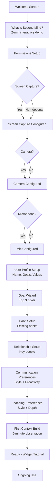

### 22.3 Home Dashboard Wireframe

```
╔════════════════════════════════════════════════════════════════╗
║  Second Mind                        [Search] [Settings] [⊕]   ║
╠══════════════╦═════════════════════════════════════════════════╣
║              ║  Good morning, Alex! ☀️                        ║
║  [Avatar]    ║  Tuesday, June 7 · Focus score: 82 · Day 47    ║
║              ║                                                 ║
║  Navigation: ║  TODAY'S BRIEF                                  ║
║              ║  ┌──────────────────────────────────────────┐  ║
║  🏠 Home     ║  │ Top 3 priorities:                        │  ║
║  💬 Chat     ║  │ 1. Finish auth module (2h estimated)     │  ║
║  🧠 Memory   ║  │ 2. Weekly review with Maria (3pm)       │  ║
║  🎯 Goals    ║  │ 3. Review ML paper (saved from yest.)   │  ║
║  📚 Learn    ║  └──────────────────────────────────────────┘  ║
║  💪 Habits   ║                                                 ║
║  👥 People   ║  GOAL PROGRESS          HABITS TODAY            ║
║  ❤️ Health   ║  ┌────────────────┐    ┌──────────────────────┐ ║
║  📊 Insights ║  │ Auth System 67%│    │ ✅ Exercise           │ ║
║  ⚙️ Settings ║  │ ML Course  43% │    │ ✅ Meditation         │ ║
║              ║  │ Read 12 bks 8% │    │ ⬜ Evening review     │ ║
║              ║  └────────────────┘    └──────────────────────┘ ║
║              ║                                                 ║
║              ║  RECENT LEARNING         UPCOMING               ║
║              ║  ┌────────────────┐    ┌──────────────────────┐ ║
║              ║  │ Attention in   │    │ 3pm: Maria 1:1       │ ║
║              ║  │ Transformers   │    │ 5pm: Review PR       │ ║
║              ║  │ 73% mastered   │    │ Thu: David follow-up │ ║
║              ║  └────────────────┘    └──────────────────────┘ ║
╚══════════════╩═════════════════════════════════════════════════╝
```

### 22.4 Chat Interface Wireframe

```
╔═══════════════════════════════════════════════════╗
║  Chat with Second Mind          [Context] [Clear] ║
╠═══════════════════════════════════════════════════╣
║  CURRENT CONTEXT                                  ║
║  ┌─────────────────────────────────────────────┐  ║
║  │ 📄 auth.ts  •  Debugging JWT middleware      │  ║
║  │ 🎯 Related goal: Build Auth System           │  ║
║  │ 🧠 Using: JWT, TypeScript, Express           │  ║
║  └─────────────────────────────────────────────┘  ║
║                                                   ║
║  ┌─────────────────────────────────────────────┐  ║
║  │                                          🤖 │  ║
║  │  I noticed you've been working on the JWT   │  ║
║  │  middleware for about 40 minutes. The error │  ║
║  │  you're seeing (401 on valid tokens) often  │  ║
║  │  comes from clock skew between the signing  │  ║
║  │  and verification servers.                  │  ║
║  │                                             │  ║
║  │  Want me to walk through the 3 most common  │  ║
║  │  causes?                                    │  ║
║  │                                      ┌──┐   │  ║
║  │                              Yes     │  │   │  ║
║  │                              No thanks│  │   │  ║
║  └─────────────────────────────────────────────┘  ║
║                                                   ║
║  ┌─────────────────────────────────────────────┐  ║
║  │ 👤 Yes please                               │  ║
║  └─────────────────────────────────────────────┘  ║
║                                                   ║
║  ┌─────────────────────────────────────────────┐  ║
║  │                                          🤖 │  ║
║  │  The 3 most common causes of JWT 401s:     │  ║
║  │  ...                                        │  ║
║  └─────────────────────────────────────────────┘  ║
║                                                   ║
║  ┌─────────────────────────────────────────────┐  ║
║  │ Type a message or press Ctrl+Shift+Space    │  ║
║  │ to speak                              [Send]│  ║
║  └─────────────────────────────────────────────┘  ║
╚═══════════════════════════════════════════════════╝
```

### 22.5 App Settings Schema

```typescript
interface AppSettings {
  general: {
    userName: string;
    userTimezone: string;
    language: 'en' | 'es' | 'fr' | 'de' | 'ja' | 'zh' | string;
    theme: 'system' | 'light' | 'dark';
    startupBehavior: 'minimize_to_tray' | 'show_widget' | 'show_dashboard';
    globalShortcut: string;
    autoStart: boolean;
    checkForUpdates: 'auto' | 'notify' | 'never';
  };
  
  widget: {
    position: 'bottom_right' | 'bottom_left' | 'top_right' | 'top_left' | 'custom';
    opacity: number;
    size: 'small' | 'medium' | 'large';
    showOnAllDesktops: boolean;
    hideOnFullscreen: boolean;
    snapToEdge: boolean;
    animationsEnabled: boolean;
  };
  
  capture: {
    screenCapture: boolean;
    captureIntervalMs: number;
    excludedApps: string[];
    excludedUrls: string[];
    cameraEnabled: boolean;
    microphoneEnabled: boolean;
    captureQuality: 'low' | 'medium' | 'high';
  };
  
  ai: {
    primaryModel: 'local' | 'claude' | 'gpt4';
    localModelPath: string | null;
    anthropicApiKey: string | null;
    openaiApiKey: string | null;
    allowCloudFallback: boolean;
    streamResponses: boolean;
    maxTokensPerRequest: number;
  };
  
  voice: {
    enabled: boolean;
    mode: VoiceMode;
    persona: string;
    wakeWord: string;
    pushToTalkKey: string;
    outputSpeed: number;
    localTTS: boolean;
    elevenLabsApiKey: string | null;
  };
  
  notifications: {
    enabled: boolean;
    style: 'popup' | 'widget_pulse' | 'silent';
    sound: boolean;
    quietHoursEnabled: boolean;
    quietHoursStart: string;
    quietHoursEnd: string;
    maxPerHour: number;
  };
  
  privacy: {
    memoryRetentionDays: number;
    autoDeleteSensitiveData: boolean;
    cloudSyncEnabled: boolean;
    analyticsEnabled: boolean;
    crashReportingEnabled: boolean;
    exportEncrypted: boolean;
  };
  
  sync: {
    enabled: boolean;
    provider: 'supabase' | 'self_hosted' | null;
    encryptionEnabled: boolean;
    syncFrequency: 'realtime' | 'hourly' | 'daily';
    devicesAllowed: string[];
  };
}
```

---

## 23. Security Architecture

### 23.1 Encryption Configuration

```typescript
interface EncryptionConfig {
  // At rest
  databaseEncryption: {
    algorithm: 'AES-256-GCM';
    keyDerivation: 'Argon2id';
    keyStored: 'OS_keychain'; // Never in plain text
  };
  
  // Vector database
  vectorDBEncryption: {
    algorithm: 'AES-256-GCM';
    encryptMetadata: true;
    encryptVectors: true;
  };
  
  // In transit (cloud sync)
  transitEncryption: {
    protocol: 'TLS 1.3';
    certificatePinning: true;
    hpke: true; // Hybrid Public Key Encryption for E2E
  };
  
  // Export
  exportEncryption: {
    algorithm: 'AES-256-GCM';
    userPasswordDerived: true; // Key from user password, not system
  };
  
  // Memory protection
  memoryProtection: {
    sensitiveDataInSecureMemory: true;
    wipeOnClear: true; // Overwrite memory, don't just free
    antiDumpProtection: true;
  };
}
```

### 23.2 Authentication

```typescript
interface AuthConfig {
  // Local authentication
  local: {
    methods: ('password' | 'biometric' | 'pin')[];
    sessionTimeoutMinutes: number;
    requireReauthForExport: true;
    requireReauthForDelete: true;
    maxFailedAttempts: number;
    lockoutDurationMinutes: number;
  };
  
  // Cloud authentication (for sync)
  cloud: {
    provider: 'supabase_auth';
    mfaRequired: boolean;
    sessionDurationHours: number;
    deviceTrustEnabled: boolean;
  };
}
```

### 23.3 Audit Log

```typescript
interface AuditLog {
  id: string;
  userId: string;
  eventType: AuditEventType;
  timestamp: Date;
  details: Record<string, unknown>;
  ipAddress: string | null; // for cloud events only
  deviceId: string;
  success: boolean;
  errorMessage: string | null;
}

type AuditEventType =
  | 'login' | 'logout' | 'failed_login'
  | 'memory_export' | 'memory_delete' | 'memory_bulk_delete'
  | 'settings_change' | 'privacy_change'
  | 'api_key_added' | 'api_key_removed'
  | 'cloud_sync_enabled' | 'cloud_sync_disabled'
  | 'capture_enabled' | 'capture_disabled'
  | 'emergency_shutdown'
  | 'data_deletion_requested' | 'data_deletion_completed';
```

### 23.4 Emergency Shutdown

```typescript
class EmergencyShutdown {
  // Triggered by: panic key combo, system compromise detection, or user request
  async execute(reason: string): Promise<void> {
    // 1. Immediately stop all screen/camera capture
    await this.captureEngine.stopAll();
    
    // 2. Clear all in-memory data
    await this.memoryManager.clearWorkingMemory();
    
    // 3. Stop all outgoing network requests
    await this.networkManager.cancelAll();
    
    // 4. Lock the application
    await this.authManager.lockSession();
    
    // 5. Log the event
    await this.auditLog.write({ eventType: 'emergency_shutdown', details: { reason } });
    
    // 6. Hide the UI completely
    this.ui.hide();
    
    // Optional: 7. Delete sensitive in-progress data
    // (configurable, default: no deletion)
  }
}
```

---

## 24. Privacy System

### 24.1 Privacy Modes

```typescript
type PrivacyMode =
  | 'standard'     // Normal operation with all user-consented features
  | 'private'      // No capture, no memory writing, ephemeral only
  | 'incognito'    // Like private but also hides that the app is running
  | 'work'         // Work context - may have different capture rules
  | 'sensitive';   // Extra protection - redacts more, stores less

interface PrivacyModeConfig {
  mode: PrivacyMode;
  screenCapture: boolean;
  cameraEnabled: boolean;
  microphoneEnabled: boolean;
  memoryWriting: boolean;
  cloudSync: boolean;
  analytics: boolean;
  visibleInTaskbar: boolean;
}

const PRIVACY_MODE_DEFAULTS: Record<PrivacyMode, PrivacyModeConfig> = {
  standard:   { mode: 'standard',   screenCapture: true,  cameraEnabled: false, microphoneEnabled: false, memoryWriting: true,  cloudSync: false, analytics: false, visibleInTaskbar: true  },
  private:    { mode: 'private',    screenCapture: false, cameraEnabled: false, microphoneEnabled: false, memoryWriting: false, cloudSync: false, analytics: false, visibleInTaskbar: true  },
  incognito:  { mode: 'incognito',  screenCapture: false, cameraEnabled: false, microphoneEnabled: false, memoryWriting: false, cloudSync: false, analytics: false, visibleInTaskbar: false },
  work:       { mode: 'work',       screenCapture: true,  cameraEnabled: false, microphoneEnabled: false, memoryWriting: true,  cloudSync: false, analytics: false, visibleInTaskbar: true  },
  sensitive:  { mode: 'sensitive',  screenCapture: false, cameraEnabled: false, microphoneEnabled: false, memoryWriting: false, cloudSync: false, analytics: false, visibleInTaskbar: true  },
};
```

### 24.2 Data Residency

```typescript
interface DataResidency {
  screenFrames: 'never_stored';        // Never persisted to disk
  ocrText: 'local_only';              // Processed locally, stored locally if important
  cameraFrames: 'never_stored';        // Real-time processing only, never persisted
  memories: 'local_primary';           // Local by default, cloud opt-in
  knowledgeGraph: 'local_primary';     // Local by default, cloud opt-in
  preferences: 'local_primary';        // Local by default, synced if enabled
  analytics: 'local_only';            // Never sent anywhere by default
  apiCalls: 'content_not_stored';     // Cloud API calls don't store user data (per API ToS)
}
```

### 24.3 Privacy-by-Design Checklist

Every new feature must pass this checklist before shipping:

```typescript
interface PrivacyDesignChecklist {
  dataMinimization: boolean;          // Collects minimum necessary data
  purposeLimitation: boolean;         // Data used only for stated purpose
  storageMinimization: boolean;       // Stored only as long as necessary
  userControl: boolean;               // User can see, edit, delete their data
  transparency: boolean;              // User knows what's collected and why
  securityByDefault: boolean;         // Encrypted at rest and in transit
  localFirst: boolean;                // Local processing preferred over cloud
  auditLogged: boolean;               // Data operations are audited
  exportable: boolean;                // User can export their data
  deletable: boolean;                 // User can delete their data
}
```

---

## 25. Technology Stack

### 25.1 Frontend

```typescript
interface FrontendStack {
  framework: 'React 18 + TypeScript';
  desktopShell: 'Tauri 2.0'; // Rust-based, lighter than Electron
  stateManagement: 'Zustand + React Query';
  ui: {
    components: 'Radix UI (headless) + Tailwind CSS';
    animations: 'Framer Motion';
    icons: 'Lucide React';
    charts: 'Recharts';
    graphVisualization: 'React Force Graph + D3.js';
  };
  testing: 'Vitest + React Testing Library + Playwright';
  bundler: 'Vite';
}
```

### 25.2 Backend (Rust - Tauri Sidecar)

```typescript
interface BackendStack {
  language: 'Rust (stable)';
  asyncRuntime: 'Tokio';
  webFramework: 'Axum';
  screenCapture: 'custom Rust + OS APIs (CoreGraphics/X11/WinAPI)';
  accessibility: 'accessibility-rs + OS accessibility APIs';
  ipc: 'Tauri IPC (type-safe commands)';
}
```

### 25.3 Databases

```typescript
interface DatabaseStack {
  primary: {
    engine: 'SQLite 3.45+';
    wrapper: 'SQLx (Rust) + Prisma (TypeScript)';
    encryption: 'SQLCipher 4';
    location: 'User AppData directory';
  };
  vector: {
    engine: 'Qdrant (local mode)';
    dimensions: 1536; // OpenAI compatible
    indexing: 'HNSW';
  };
  graph: {
    engine: 'SurrealDB';
    mode: 'embedded';
    queryLanguage: 'SurrealQL';
  };
  cache: {
    engine: 'Moka (in-process Rust cache)';
    strategy: 'LRU + TTL';
  };
}
```

### 25.4 Local AI Models

```typescript
interface LocalModelStack {
  llm: {
    model: 'Phi-3.5-mini-instruct (3.8B)';
    quantization: 'Q4_K_M';
    runtime: 'llama.cpp (via llama-rs)';
    contextWindow: 128000;
    fallback: 'Qwen2.5-7B for complex tasks';
  };
  vision: {
    model: 'LLaVA-1.6-mistral-7B';
    quantization: 'Q4_K_M';
    runtime: 'llama.cpp';
    useCase: 'Screen understanding + OCR fallback';
  };
  stt: {
    model: 'Whisper large-v3 (quantized)';
    runtime: 'whisper-rs';
    language: 'multilingual';
    realtimeCapable: true;
  };
  tts: {
    model: 'Kokoro-82M';
    runtime: 'kokoro-rs';
    voices: 8; // English voices
    latencyMs: '<200';
  };
  wakeWord: {
    model: 'openWakeWord';
    runtime: 'Python sidecar';
    customKeywords: true;
    falsePositiveRate: '<0.1%';
  };
  embeddings: {
    model: 'nomic-embed-text-v1.5 (local)';
    dimensions: 768;
    runtime: 'fastembed-rs';
    fallback: 'text-embedding-3-small (OpenAI)';
  };
}
```

### 25.5 Cloud Services (Optional)

```typescript
interface CloudStack {
  llm: {
    provider: 'Anthropic';
    model: 'claude-sonnet-4-20250514';
    useCase: 'Complex reasoning tasks requiring > local model capability';
    dataPolicy: 'Requests only, no retention (per Anthropic API ToS)';
  };
  tts: {
    provider: 'ElevenLabs';
    useCase: 'High-quality voice output (optional premium)';
  };
  sync: {
    provider: 'Supabase';
    features: ['Auth', 'PostgreSQL', 'Realtime', 'Edge Functions'];
    encryption: 'Client-side E2E before upload';
  };
  search: {
    provider: 'Brave Search API';
    useCase: 'Web search for Research Agent';
  };
  monitoring: {
    provider: 'Self-hosted Sentry (optional)';
    analytics: 'PostHog (self-hosted, opt-in)';
  };
}
```

### 25.6 Build & Infrastructure

```typescript
interface BuildStack {
  cicd: 'GitHub Actions';
  codeQuality: 'ESLint + Prettier + Clippy (Rust)';
  testing: 'Vitest + Playwright + cargo test';
  packageManager: 'pnpm';
  releases: 'Tauri GitHub Releases + auto-updater';
  platforms: ['macOS 13+', 'Windows 11 10+', 'Ubuntu 22.04+'];
  signing: {
    mac: 'Apple Developer Certificate';
    windows: 'Code Signing Certificate';
    linux: 'GPG Signing';
  };
}
```

---

## 26. Database Design

### 26.1 SQLite Schema

```sql
-- ========================
-- USERS & PROFILE
-- ========================

CREATE TABLE users (
  id TEXT PRIMARY KEY DEFAULT (lower(hex(randomblob(16)))),
  name TEXT NOT NULL,
  timezone TEXT NOT NULL DEFAULT 'UTC',
  language TEXT NOT NULL DEFAULT 'en',
  created_at DATETIME NOT NULL DEFAULT CURRENT_TIMESTAMP,
  updated_at DATETIME NOT NULL DEFAULT CURRENT_TIMESTAMP,
  onboarding_completed_at DATETIME,
  last_active_at DATETIME
);

CREATE TABLE user_preferences (
  id TEXT PRIMARY KEY DEFAULT (lower(hex(randomblob(16)))),
  user_id TEXT NOT NULL REFERENCES users(id) ON DELETE CASCADE,
  category TEXT NOT NULL, -- 'communication', 'intervention', 'teaching', 'privacy', etc.
  key TEXT NOT NULL,
  value TEXT NOT NULL, -- JSON serialized
  source TEXT NOT NULL DEFAULT 'explicit', -- 'explicit' | 'inferred'
  confidence REAL NOT NULL DEFAULT 1.0,
  evidence TEXT, -- JSON array of evidence IDs
  created_at DATETIME NOT NULL DEFAULT CURRENT_TIMESTAMP,
  updated_at DATETIME NOT NULL DEFAULT CURRENT_TIMESTAMP,
  UNIQUE(user_id, category, key)
);

CREATE INDEX idx_preferences_user ON user_preferences(user_id);
CREATE INDEX idx_preferences_category ON user_preferences(user_id, category);

-- ========================
-- MEMORIES
-- ========================

CREATE TABLE memories (
  id TEXT PRIMARY KEY DEFAULT (lower(hex(randomblob(16)))),
  user_id TEXT NOT NULL REFERENCES users(id) ON DELETE CASCADE,
  type TEXT NOT NULL CHECK(type IN (
    'semantic', 'episodic', 'procedural', 'project', 'goal',
    'learning', 'relationship', 'preference', 'reflection', 'commitment', 'habit'
  )),
  content TEXT NOT NULL,
  summary TEXT,
  importance INTEGER NOT NULL DEFAULT 50 CHECK(importance BETWEEN 0 AND 100),
  confidence INTEGER NOT NULL DEFAULT 75 CHECK(confidence BETWEEN 0 AND 100),
  
  -- Vector search reference (vector stored in Qdrant)
  embedding_id TEXT, -- ID in Qdrant collection
  
  -- Temporal
  created_at DATETIME NOT NULL DEFAULT CURRENT_TIMESTAMP,
  last_accessed_at DATETIME NOT NULL DEFAULT CURRENT_TIMESTAMP,
  access_count INTEGER NOT NULL DEFAULT 1,
  decay_score REAL NOT NULL DEFAULT 1.0 CHECK(decay_score BETWEEN 0 AND 1),
  
  -- Links (JSON arrays of IDs)
  related_memory_ids TEXT DEFAULT '[]',
  related_goal_ids TEXT DEFAULT '[]',
  related_person_ids TEXT DEFAULT '[]',
  related_project_ids TEXT DEFAULT '[]',
  
  -- Source
  source_context_id TEXT,
  
  -- Tags
  tags TEXT DEFAULT '[]', -- JSON array
  
  -- Privacy
  sensitivity_level TEXT NOT NULL DEFAULT 'private' 
    CHECK(sensitivity_level IN ('public', 'private', 'sensitive', 'confidential')),
  
  -- Status
  verified BOOLEAN NOT NULL DEFAULT FALSE,
  user_edited BOOLEAN NOT NULL DEFAULT FALSE,
  deleted_at DATETIME,
  
  -- Type-specific data (JSON)
  type_data TEXT DEFAULT '{}'
);

CREATE INDEX idx_memories_user ON memories(user_id);
CREATE INDEX idx_memories_type ON memories(user_id, type);
CREATE INDEX idx_memories_importance ON memories(user_id, importance DESC);
CREATE INDEX idx_memories_accessed ON memories(user_id, last_accessed_at DESC);
CREATE INDEX idx_memories_decay ON memories(user_id, decay_score);
CREATE INDEX idx_memories_not_deleted ON memories(user_id, deleted_at) WHERE deleted_at IS NULL;
CREATE VIRTUAL TABLE memories_fts USING fts5(content, summary, tags, content=memories, content_rowid=rowid);

-- ========================
-- PEOPLE
-- ========================

CREATE TABLE people (
  id TEXT PRIMARY KEY DEFAULT (lower(hex(randomblob(16)))),
  user_id TEXT NOT NULL REFERENCES users(id) ON DELETE CASCADE,
  name TEXT NOT NULL,
  nickname TEXT,
  pronouns TEXT,
  relationship_type TEXT NOT NULL,
  closeness_level INTEGER NOT NULL DEFAULT 50 CHECK(closeness_level BETWEEN 0 AND 100),
  trust_level INTEGER NOT NULL DEFAULT 50 CHECK(trust_level BETWEEN 0 AND 100),
  
  -- Contact
  email TEXT,
  phone TEXT,
  linkedin_url TEXT,
  
  -- Demographics
  birthday DATE,
  location TEXT,
  occupation TEXT,
  organization TEXT,
  
  -- Notes
  personality_notes TEXT,
  communication_style TEXT,
  interests TEXT DEFAULT '[]', -- JSON
  values TEXT DEFAULT '[]',    -- JSON
  important_facts TEXT DEFAULT '[]', -- JSON
  current_situation_summary TEXT,
  summary_updated_at DATETIME,
  
  -- Interaction
  last_interaction_at DATETIME,
  last_interaction_type TEXT,
  interaction_frequency_target TEXT NOT NULL DEFAULT 'monthly',
  
  -- Important dates (JSON)
  important_dates TEXT DEFAULT '[]',
  
  -- Relationship health
  relationship_health_score INTEGER DEFAULT 70,
  health_assessed_at DATETIME,
  current_topics TEXT DEFAULT '[]', -- JSON
  
  -- Status
  is_active BOOLEAN NOT NULL DEFAULT TRUE,
  created_at DATETIME NOT NULL DEFAULT CURRENT_TIMESTAMP,
  updated_at DATETIME NOT NULL DEFAULT CURRENT_TIMESTAMP
);

CREATE INDEX idx_people_user ON people(user_id);
CREATE INDEX idx_people_last_interaction ON people(user_id, last_interaction_at);

-- ========================
-- GOALS
-- ========================

CREATE TABLE goals (
  id TEXT PRIMARY KEY DEFAULT (lower(hex(randomblob(16)))),
  user_id TEXT NOT NULL REFERENCES users(id) ON DELETE CASCADE,
  title TEXT NOT NULL,
  description TEXT,
  why_it_matters TEXT,
  vision TEXT,
  
  -- Hierarchy
  type TEXT NOT NULL CHECK(type IN ('lifetime', 'annual', 'quarterly', 'monthly', 'weekly', 'project')),
  parent_goal_id TEXT REFERENCES goals(id),
  
  -- Category
  category TEXT NOT NULL,
  
  -- Success criteria (JSON)
  success_criteria TEXT DEFAULT '[]',
  
  -- Timeline
  start_date DATE,
  target_date DATE,
  completed_at DATETIME,
  
  -- Progress
  progress_percent INTEGER NOT NULL DEFAULT 0 CHECK(progress_percent BETWEEN 0 AND 100),
  last_progress_update_at DATETIME,
  
  -- Status
  status TEXT NOT NULL DEFAULT 'active' 
    CHECK(status IN ('draft', 'active', 'paused', 'completed', 'abandoned')),
  priority INTEGER NOT NULL DEFAULT 3 CHECK(priority BETWEEN 1 AND 5),
  
  -- Alignment (JSON arrays)
  aligned_habit_ids TEXT DEFAULT '[]',
  aligned_project_ids TEXT DEFAULT '[]',
  aligned_skill_ids TEXT DEFAULT '[]',
  
  -- Review
  review_frequency TEXT NOT NULL DEFAULT 'weekly',
  last_reviewed_at DATETIME,
  
  -- Metadata
  created_at DATETIME NOT NULL DEFAULT CURRENT_TIMESTAMP,
  updated_at DATETIME NOT NULL DEFAULT CURRENT_TIMESTAMP,
  is_archived BOOLEAN NOT NULL DEFAULT FALSE
);

CREATE INDEX idx_goals_user ON goals(user_id);
CREATE INDEX idx_goals_status ON goals(user_id, status);
CREATE INDEX idx_goals_priority ON goals(user_id, priority);
CREATE INDEX idx_goals_parent ON goals(parent_goal_id);

CREATE TABLE goal_metrics (
  id TEXT PRIMARY KEY DEFAULT (lower(hex(randomblob(16)))),
  goal_id TEXT NOT NULL REFERENCES goals(id) ON DELETE CASCADE,
  user_id TEXT NOT NULL REFERENCES users(id) ON DELETE CASCADE,
  name TEXT NOT NULL,
  unit TEXT NOT NULL,
  current_value REAL NOT NULL DEFAULT 0,
  target_value REAL NOT NULL,
  start_value REAL NOT NULL DEFAULT 0,
  measurement_frequency TEXT NOT NULL DEFAULT 'weekly',
  last_measured_at DATETIME,
  history TEXT DEFAULT '[]', -- JSON array of {date, value}
  created_at DATETIME NOT NULL DEFAULT CURRENT_TIMESTAMP,
  updated_at DATETIME NOT NULL DEFAULT CURRENT_TIMESTAMP
);

-- ========================
-- HABITS
-- ========================

CREATE TABLE habits (
  id TEXT PRIMARY KEY DEFAULT (lower(hex(randomblob(16)))),
  user_id TEXT NOT NULL REFERENCES users(id) ON DELETE CASCADE,
  name TEXT NOT NULL,
  description TEXT,
  category TEXT NOT NULL,
  
  -- Atomic Habits framework
  cue TEXT,
  routine TEXT,
  reward TEXT,
  environment_design TEXT,
  
  -- Scheduling
  target_frequency TEXT NOT NULL DEFAULT 'daily',
  target_days TEXT DEFAULT '[]', -- JSON array [0-6]
  target_time TEXT, -- "07:00"
  target_duration_minutes INTEGER,
  
  -- Tracking
  current_streak INTEGER NOT NULL DEFAULT 0,
  longest_streak INTEGER NOT NULL DEFAULT 0,
  total_completions INTEGER NOT NULL DEFAULT 0,
  completion_rate_7d REAL NOT NULL DEFAULT 0.0,
  completion_rate_30d REAL NOT NULL DEFAULT 0.0,
  completion_rate_90d REAL NOT NULL DEFAULT 0.0,
  
  -- Relationships
  parent_goal_ids TEXT DEFAULT '[]', -- JSON
  stacked_with_habit_id TEXT REFERENCES habits(id),
  
  -- Status
  is_active BOOLEAN NOT NULL DEFAULT TRUE,
  started_at DATETIME NOT NULL DEFAULT CURRENT_TIMESTAMP,
  paused_at DATETIME,
  completed_at DATETIME,
  
  created_at DATETIME NOT NULL DEFAULT CURRENT_TIMESTAMP,
  updated_at DATETIME NOT NULL DEFAULT CURRENT_TIMESTAMP
);

CREATE INDEX idx_habits_user ON habits(user_id);
CREATE INDEX idx_habits_active ON habits(user_id, is_active);

CREATE TABLE habit_completions (
  id TEXT PRIMARY KEY DEFAULT (lower(hex(randomblob(16)))),
  habit_id TEXT NOT NULL REFERENCES habits(id) ON DELETE CASCADE,
  user_id TEXT NOT NULL REFERENCES users(id) ON DELETE CASCADE,
  completed_at DATETIME NOT NULL DEFAULT CURRENT_TIMESTAMP,
  duration_minutes INTEGER,
  quality INTEGER CHECK(quality BETWEEN 1 AND 5),
  notes TEXT,
  mood INTEGER CHECK(mood BETWEEN 1 AND 5),
  energy_level INTEGER CHECK(energy_level BETWEEN 1 AND 5)
);

CREATE INDEX idx_habit_completions_habit ON habit_completions(habit_id);
CREATE INDEX idx_habit_completions_date ON habit_completions(user_id, completed_at DESC);

-- ========================
-- KNOWLEDGE & LEARNING
-- ========================

CREATE TABLE knowledge_items (
  id TEXT PRIMARY KEY DEFAULT (lower(hex(randomblob(16)))),
  user_id TEXT NOT NULL REFERENCES users(id) ON DELETE CASCADE,
  type TEXT NOT NULL CHECK(type IN ('concept', 'skill', 'fact', 'procedure')),
  name TEXT NOT NULL,
  domain TEXT NOT NULL,
  definition TEXT,
  examples TEXT DEFAULT '[]', -- JSON
  synonyms TEXT DEFAULT '[]', -- JSON
  
  -- Proficiency
  proficiency_level INTEGER NOT NULL DEFAULT 0 CHECK(proficiency_level BETWEEN 0 AND 100),
  target_level INTEGER DEFAULT 80,
  confidence REAL NOT NULL DEFAULT 0.5,
  
  -- Spaced repetition
  sr_repetitions INTEGER NOT NULL DEFAULT 0,
  sr_easiness_factor REAL NOT NULL DEFAULT 2.5,
  sr_interval INTEGER NOT NULL DEFAULT 1,
  sr_next_review_date DATE,
  sr_last_quality INTEGER,
  
  -- History
  times_explained INTEGER NOT NULL DEFAULT 0,
  times_quizzed INTEGER NOT NULL DEFAULT 0,
  quiz_accuracy REAL,
  last_exposure_at DATETIME,
  last_tested_at DATETIME,
  
  -- Graph links (JSON)
  prerequisite_ids TEXT DEFAULT '[]',
  unlocks_ids TEXT DEFAULT '[]',
  
  -- Status
  is_mastered BOOLEAN NOT NULL DEFAULT FALSE,
  created_at DATETIME NOT NULL DEFAULT CURRENT_TIMESTAMP,
  updated_at DATETIME NOT NULL DEFAULT CURRENT_TIMESTAMP
);

CREATE INDEX idx_knowledge_user ON knowledge_items(user_id);
CREATE INDEX idx_knowledge_domain ON knowledge_items(user_id, domain);
CREATE INDEX idx_knowledge_review ON knowledge_items(user_id, sr_next_review_date);
CREATE INDEX idx_knowledge_proficiency ON knowledge_items(user_id, proficiency_level);

-- ========================
-- REFLECTIONS
-- ========================

CREATE TABLE reflections (
  id TEXT PRIMARY KEY DEFAULT (lower(hex(randomblob(16)))),
  user_id TEXT NOT NULL REFERENCES users(id) ON DELETE CASCADE,
  type TEXT NOT NULL CHECK(type IN ('daily', 'weekly', 'monthly', 'annual')),
  period_start DATE NOT NULL,
  period_end DATE NOT NULL,
  
  -- AI-generated content
  generated_content TEXT NOT NULL, -- Full JSON of reflection data
  ai_narrative TEXT,
  key_insights TEXT DEFAULT '[]', -- JSON
  
  -- User additions
  user_note TEXT,
  energy_rating INTEGER CHECK(energy_rating BETWEEN 1 AND 5),
  mood_rating INTEGER CHECK(mood_rating BETWEEN 1 AND 5),
  user_highlights TEXT,
  user_challenges TEXT,
  user_intentions TEXT,
  
  -- Metrics snapshot (JSON)
  metrics_snapshot TEXT DEFAULT '{}',
  
  -- Status
  generated_at DATETIME NOT NULL DEFAULT CURRENT_TIMESTAMP,
  user_viewed_at DATETIME,
  user_edited_at DATETIME
);

CREATE INDEX idx_reflections_user ON reflections(user_id);
CREATE INDEX idx_reflections_type ON reflections(user_id, type);
CREATE INDEX idx_reflections_period ON reflections(user_id, period_start DESC);

-- ========================
-- COMMITMENTS
-- ========================

CREATE TABLE commitments (
  id TEXT PRIMARY KEY DEFAULT (lower(hex(randomblob(16)))),
  user_id TEXT NOT NULL REFERENCES users(id) ON DELETE CASCADE,
  made_by_user_id TEXT REFERENCES users(id),
  made_to_person_id TEXT NOT NULL REFERENCES people(id),
  description TEXT NOT NULL,
  context TEXT,
  made_at DATETIME NOT NULL DEFAULT CURRENT_TIMESTAMP,
  due_at DATETIME,
  completed_at DATETIME,
  status TEXT NOT NULL DEFAULT 'pending' CHECK(status IN ('pending', 'completed', 'overdue', 'cancelled')),
  priority TEXT NOT NULL DEFAULT 'medium' CHECK(priority IN ('low', 'medium', 'high', 'critical')),
  reminder_at DATETIME,
  reminder_sent BOOLEAN NOT NULL DEFAULT FALSE,
  detected_from_screen BOOLEAN NOT NULL DEFAULT FALSE,
  user_confirmed BOOLEAN NOT NULL DEFAULT FALSE,
  notes TEXT,
  created_at DATETIME NOT NULL DEFAULT CURRENT_TIMESTAMP,
  updated_at DATETIME NOT NULL DEFAULT CURRENT_TIMESTAMP
);

CREATE INDEX idx_commitments_user ON commitments(user_id);
CREATE INDEX idx_commitments_status ON commitments(user_id, status);
CREATE INDEX idx_commitments_due ON commitments(user_id, due_at) WHERE status = 'pending';

-- ========================
-- FEEDBACK & INTERVENTIONS
-- ========================

CREATE TABLE feedback_events (
  id TEXT PRIMARY KEY DEFAULT (lower(hex(randomblob(16)))),
  user_id TEXT NOT NULL REFERENCES users(id) ON DELETE CASCADE,
  type TEXT NOT NULL,
  trigger_intervention_id TEXT,
  question TEXT NOT NULL,
  response TEXT,
  response_type TEXT, -- 'binary', 'scale', 'choice', 'text'
  responded_at DATETIME,
  dismissed_without_response BOOLEAN NOT NULL DEFAULT FALSE,
  created_at DATETIME NOT NULL DEFAULT CURRENT_TIMESTAMP
);

CREATE INDEX idx_feedback_user ON feedback_events(user_id);
CREATE INDEX idx_feedback_date ON feedback_events(user_id, created_at DESC);

CREATE TABLE interventions (
  id TEXT PRIMARY KEY DEFAULT (lower(hex(randomblob(16)))),
  user_id TEXT NOT NULL REFERENCES users(id) ON DELETE CASCADE,
  agent_type TEXT NOT NULL,
  intervention_type TEXT NOT NULL,
  content TEXT NOT NULL,
  context_snapshot TEXT, -- JSON
  cognitive_state_snapshot TEXT, -- JSON
  score INTEGER,
  delivered_at DATETIME,
  dismissed_at DATETIME,
  user_engaged BOOLEAN,
  user_feedback_id TEXT REFERENCES feedback_events(id),
  created_at DATETIME NOT NULL DEFAULT CURRENT_TIMESTAMP
);

CREATE INDEX idx_interventions_user ON interventions(user_id);
CREATE INDEX idx_interventions_type ON interventions(user_id, intervention_type);
CREATE INDEX idx_interventions_date ON interventions(user_id, created_at DESC);

-- ========================
-- HEALTH DATA
-- ========================

CREATE TABLE daily_health_data (
  id TEXT PRIMARY KEY DEFAULT (lower(hex(randomblob(16)))),
  user_id TEXT NOT NULL REFERENCES users(id) ON DELETE CASCADE,
  date DATE NOT NULL,
  
  -- Sleep
  sleep_hours REAL,
  sleep_quality INTEGER CHECK(sleep_quality BETWEEN 0 AND 100),
  bedtime DATETIME,
  wake_time DATETIME,
  
  -- Activity
  steps_count INTEGER,
  exercise_minutes INTEGER,
  exercise_type TEXT,
  calories_burned INTEGER,
  
  -- Mental
  meditation_minutes INTEGER,
  mood_rating INTEGER CHECK(mood_rating BETWEEN 1 AND 10),
  energy_level INTEGER CHECK(energy_level BETWEEN 1 AND 10),
  stress_level INTEGER CHECK(stress_level BETWEEN 1 AND 10),
  
  -- Hydration
  water_oz INTEGER,
  
  -- Computed (from screen data)
  deep_work_minutes INTEGER NOT NULL DEFAULT 0,
  break_count INTEGER NOT NULL DEFAULT 0,
  longest_focus_session INTEGER NOT NULL DEFAULT 0,
  
  -- Scores
  wellbeing_score INTEGER,
  recovery_score INTEGER,
  
  -- Source
  data_source TEXT DEFAULT 'manual', -- 'manual', 'apple_health', 'google_fit', etc.
  
  created_at DATETIME NOT NULL DEFAULT CURRENT_TIMESTAMP,
  updated_at DATETIME NOT NULL DEFAULT CURRENT_TIMESTAMP,
  
  UNIQUE(user_id, date)
);

CREATE INDEX idx_health_user ON daily_health_data(user_id);
CREATE INDEX idx_health_date ON daily_health_data(user_id, date DESC);

-- ========================
-- AUDIT LOG
-- ========================

CREATE TABLE audit_logs (
  id TEXT PRIMARY KEY DEFAULT (lower(hex(randomblob(16)))),
  user_id TEXT NOT NULL REFERENCES users(id),
  event_type TEXT NOT NULL,
  timestamp DATETIME NOT NULL DEFAULT CURRENT_TIMESTAMP,
  details TEXT DEFAULT '{}', -- JSON
  device_id TEXT NOT NULL,
  success BOOLEAN NOT NULL DEFAULT TRUE,
  error_message TEXT
);

CREATE INDEX idx_audit_user ON audit_logs(user_id);
CREATE INDEX idx_audit_type ON audit_logs(user_id, event_type);
CREATE INDEX idx_audit_date ON audit_logs(user_id, timestamp DESC);

-- ========================
-- TRIGGERS
-- ========================

-- Auto-update updated_at
CREATE TRIGGER users_update_at AFTER UPDATE ON users
  BEGIN UPDATE users SET updated_at = CURRENT_TIMESTAMP WHERE id = NEW.id; END;

CREATE TRIGGER memories_update_at AFTER UPDATE ON memories
  BEGIN UPDATE memories SET last_accessed_at = CURRENT_TIMESTAMP WHERE id = NEW.id; END;

CREATE TRIGGER goals_update_at AFTER UPDATE ON goals
  BEGIN UPDATE goals SET updated_at = CURRENT_TIMESTAMP WHERE id = NEW.id; END;

CREATE TRIGGER habits_update_at AFTER UPDATE ON habits
  BEGIN UPDATE habits SET updated_at = CURRENT_TIMESTAMP WHERE id = NEW.id; END;
```

### 26.2 Vector Database Schema (Qdrant)

```typescript
// Qdrant collection configurations

const MEMORY_COLLECTION = {
  name: 'memories',
  vectors: {
    size: 768,      // nomic-embed-text dimensions
    distance: 'Cosine',
  },
  optimizers_config: {
    default_segment_number: 4,
  },
  replication_factor: 1,
  // Payload schema (indexed for filtering)
  payload_schema: {
    user_id: 'keyword',
    memory_type: 'keyword',
    importance: 'integer',
    created_at: 'datetime',
    tags: 'keyword[]',
    sensitivity_level: 'keyword',
    deleted: 'bool',
  },
};

const KNOWLEDGE_COLLECTION = {
  name: 'knowledge_items',
  vectors: {
    size: 768,
    distance: 'Cosine',
  },
  payload_schema: {
    user_id: 'keyword',
    domain: 'keyword',
    proficiency_level: 'integer',
    is_mastered: 'bool',
  },
};
```

### 26.3 SurrealDB Graph Schema

```surql
-- Define tables
DEFINE TABLE person SCHEMAFULL;
DEFINE TABLE goal SCHEMAFULL;
DEFINE TABLE concept SCHEMAFULL;
DEFINE TABLE skill SCHEMAFULL;
DEFINE TABLE habit SCHEMAFULL;
DEFINE TABLE project SCHEMAFULL;

-- Define person fields
DEFINE FIELD user_id ON person TYPE string;
DEFINE FIELD name ON person TYPE string;
DEFINE FIELD relationship_type ON person TYPE string;
DEFINE FIELD closeness_level ON person TYPE int;

-- Define edges (relationships)
DEFINE TABLE supports SCHEMAFULL; -- habit/skill/project -> goal
DEFINE TABLE requires SCHEMAFULL; -- goal -> skill
DEFINE TABLE leads_to SCHEMAFULL; -- concept -> concept
DEFINE TABLE knows SCHEMAFULL;    -- person -> person
DEFINE TABLE committed_to SCHEMAFULL; -- person -> commitment

-- Define edge fields
DEFINE FIELD weight ON supports TYPE float DEFAULT 1.0;
DEFINE FIELD context ON supports TYPE option<string>;
DEFINE FIELD created_at ON supports TYPE datetime DEFAULT time::now();

-- Example graph queries
-- Find all people connected to a goal
SELECT <-knows<-person FROM goal WHERE id = $goalId;

-- Find concept prerequisites
SELECT ->requires->concept FROM concept WHERE name = $name;

-- Shortest learning path
SELECT id, name FROM concept
  WHERE shortestPath($start, $end) CONTAINS id;
```

---

## 27. API Design

### 27.1 Internal IPC API (Tauri Commands)

```typescript
// Memory API
interface MemoryAPI {
  'memory:store': (input: {
    content: string;
    type: MemoryType;
    importance?: number;
    tags?: string[];
    relatedIds?: string[];
  }) => Promise<{ memoryId: string }>;
  
  'memory:search': (input: {
    query: string;
    type?: MemoryType;
    limit?: number;
    minImportance?: number;
    dateRange?: { start: Date; end: Date };
  }) => Promise<{ memories: Memory[] }>;
  
  'memory:get': (input: { id: string }) => Promise<Memory>;
  
  'memory:update': (input: {
    id: string;
    content?: string;
    importance?: number;
    tags?: string[];
  }) => Promise<void>;
  
  'memory:delete': (input: { id: string }) => Promise<void>;
  
  'memory:export': (input: {
    format: 'json' | 'markdown' | 'csv';
    types?: MemoryType[];
    dateRange?: { start: Date; end: Date };
    encrypt?: boolean;
    password?: string;
  }) => Promise<{ filePath: string }>;
}

// Goal API
interface GoalAPI {
  'goal:create': (input: Omit<Goal, 'id' | 'createdAt' | 'updatedAt'>) => Promise<Goal>;
  'goal:get': (input: { id: string }) => Promise<Goal>;
  'goal:list': (input: { status?: Goal['status']; category?: string }) => Promise<Goal[]>;
  'goal:update': (input: Partial<Goal> & { id: string }) => Promise<Goal>;
  'goal:delete': (input: { id: string }) => Promise<void>;
  'goal:check-alignment': (input: { activityContext: string }) => Promise<GoalAlignmentScore>;
  'goal:get-progress': (input: { id: string }) => Promise<GoalProgressSummary>;
}

// People API
interface PeopleAPI {
  'people:create': (input: Omit<Person, 'id' | 'createdAt' | 'updatedAt'>) => Promise<Person>;
  'people:get': (input: { id: string }) => Promise<Person>;
  'people:list': (input: { relationshipType?: RelationshipType }) => Promise<Person[]>;
  'people:update': (input: Partial<Person> & { id: string }) => Promise<Person>;
  'people:log-interaction': (input: {
    personId: string;
    type: InteractionType;
    notes?: string;
    commitmentsMade?: string[];
  }) => Promise<void>;
  'people:get-insights': (input: { personId: string }) => Promise<RelationshipInsights>;
  'people:get-upcoming-actions': () => Promise<Array<{ person: Person; action: string; dueAt: Date }>>;
}

// Knowledge API
interface KnowledgeAPI {
  'knowledge:get-domain-map': (input: { domain: string }) => Promise<DomainKnowledge>;
  'knowledge:get-due-reviews': () => Promise<ConceptKnowledge[]>;
  'knowledge:update-proficiency': (input: {
    conceptId: string;
    quality: number; // 0-5, SM-2 quality
  }) => Promise<SM2Data>;
  'knowledge:generate-quiz': (input: {
    conceptId: string;
    style?: QuizStyle;
    difficulty?: 'beginner' | 'intermediate' | 'advanced';
  }) => Promise<Quiz>;
}

// Habit API
interface HabitAPI {
  'habit:create': (input: Omit<Habit, 'id' | 'createdAt' | 'updatedAt'>) => Promise<Habit>;
  'habit:complete': (input: {
    habitId: string;
    quality?: number;
    notes?: string;
    mood?: number;
  }) => Promise<HabitCompletion>;
  'habit:get-dashboard': (input: { date: Date }) => Promise<HabitDashboard>;
}

// Agent API
interface AgentAPI {
  'agent:chat': (input: {
    message: string;
    agentType?: AgentType;
    context?: Record<string, unknown>;
    streaming?: boolean;
  }) => Promise<AsyncIterable<string> | { response: string }>;
  
  'agent:get-context': () => Promise<SessionContext>;
  
  'agent:get-cognitive-state': () => Promise<CognitiveStateSnapshot>;
  
  'agent:request-reflection': (input: {
    type: 'daily' | 'weekly' | 'monthly' | 'annual';
    forceGenerate?: boolean;
  }) => Promise<DailyReflection | WeeklyReview | MonthlyReview | AnnualReview>;
}

// Voice API
interface VoiceAPI {
  'voice:start': (input: { mode: VoiceMode }) => Promise<void>;
  'voice:stop': () => Promise<void>;
  'voice:speak': (input: { text: string; persona?: string }) => Promise<void>;
  'voice:get-status': () => Promise<{ active: boolean; mode: VoiceMode; listening: boolean }>;
}

// Settings API
interface SettingsAPI {
  'settings:get': () => Promise<AppSettings>;
  'settings:update': (input: Partial<AppSettings>) => Promise<AppSettings>;
  'settings:reset': (input: { category?: string }) => Promise<void>;
  'settings:test-api-key': (input: { provider: string; key: string }) => Promise<{ valid: boolean }>;
}
```

### 27.2 Cloud REST API (for sync)

```
Base URL: https://api.secondmind.app/v1
Authentication: Bearer JWT

POST   /auth/login
POST   /auth/logout
POST   /auth/refresh
DELETE /auth/sessions/{sessionId}

GET    /sync/status
POST   /sync/push         { data: EncryptedSyncPacket }
POST   /sync/pull         { since: ISO8601Date }
DELETE /sync/data         { confirm: 'DELETE_ALL' }

GET    /devices
POST   /devices/register  { deviceId, deviceName, publicKey }
DELETE /devices/{deviceId}

GET    /account
PATCH  /account
DELETE /account           { confirm: 'DELETE_ACCOUNT' }
```

### 27.3 WebSocket API (Streaming)

```typescript
// WebSocket connection: ws://localhost:{port}/ws

interface WSMessage {
  id: string;
  type: WSMessageType;
  payload: unknown;
  timestamp: Date;
}

type WSMessageType =
  // Client → Server
  | 'subscribe_context'    // Subscribe to context updates
  | 'subscribe_cognitive'  // Subscribe to cognitive state updates
  | 'stream_chat'          // Start streaming chat response
  | 'cancel_stream'        // Cancel ongoing stream
  
  // Server → Client
  | 'context_update'       // New context available
  | 'cognitive_update'     // Cognitive state changed
  | 'intervention'         // New proactive intervention
  | 'chat_token'           // Streaming chat token
  | 'chat_complete'        // Streaming chat finished
  | 'memory_created'       // New memory stored
  | 'habit_reminder'       // Habit due
  | 'commitment_reminder'; // Commitment due
```

---

## 28. Edge Cases & Failure Modes

### 28.1 Screen Awareness Edge Cases

| Edge Case | Detection | Handling |
|-----------|-----------|----------|
| Multiple monitors | OS window enumeration | Capture all; mark primary |
| Screen sharing (user sharing) | App name detection | Pause capture or show privacy warning |
| Screen sharing (user presenting) | Fullscreen + conferencing app | Continue capture; don't interrupt |
| Rapid app switching | Delta detection | Batch context updates; don't process each switch individually |
| Very small text | OCR quality score | Fall back to vision model with higher resolution crop |
| Dark mode / high contrast | Color analysis | Normalize images before OCR |
| Retina/4K display | Resolution detection | Downsample before processing; use accessibility API |
| Split screen apps | Window bounds analysis | Process each window separately |
| Browser in incognito | URL unavailable | Use page title + content only; don't infer URL |
| PDF in browser vs. native | App context | Use appropriate extractor |
| VPN/proxy URLs | URL analysis | Don't infer sensitive context from URLs |

### 28.2 Offline Capabilities

```typescript
interface OfflineCapabilities {
  // Always works offline
  fullyOffline: [
    'local_llm_chat',
    'memory_read_write',
    'habit_tracking',
    'goal_viewing',
    'screen_capture_processing',
    'local_tts',
    'local_stt',
    'wake_word',
    'knowledge_graph_queries',
    'spaced_repetition_reviews',
    'reflection_generation_simple',
  ];
  
  // Degraded but functional
  degradedOffline: [
    { feature: 'cloud_llm', degradation: 'falls_back_to_local_model' },
    { feature: 'web_search', degradation: 'uses_memory_only' },
    { feature: 'sync', degradation: 'queues_for_when_online' },
    { feature: 'cloud_tts', degradation: 'falls_back_to_local_tts' },
  ];
  
  // Unavailable offline
  unavailableOffline: [
    'cloud_sync',
    'web_research',
    'real_time_news',
  ];
}
```

### 28.3 Model Failure Handling

```typescript
class ModelFailureHandler {
  async handleLLMFailure(
    request: LLMRequest,
    error: Error,
    attemptCount: number
  ): Promise<LLMResponse> {
    if (attemptCount >= 3) {
      return this.gracefulDegradation(request);
    }
    
    // Try fallback model
    if (error instanceof ModelCapacityError) {
      return this.localModel.complete(request); // Fall back to local
    }
    
    if (error instanceof NetworkError) {
      return this.localModel.complete(request); // Use local when offline
    }
    
    if (error instanceof TokenLimitError) {
      const truncated = this.truncateRequest(request);
      return this.retry(truncated, attemptCount + 1);
    }
    
    return this.gracefulDegradation(request);
  }
  
  private gracefulDegradation(request: LLMRequest): LLMResponse {
    // Return a helpful message instead of crashing
    return {
      content: "I'm having trouble processing that right now. You can find relevant information in your Memory section, or try rephrasing your question.",
      degraded: true,
    };
  }
}
```

### 28.4 Incorrect Memory Handling

```typescript
interface MemoryCorrection {
  memoryId: string;
  correctionType: 'factually_wrong' | 'outdated' | 'misattributed' | 'privacy_violation';
  userNote: string;
  action: 'update' | 'delete' | 'flag';
}

class MemoryCorrectionSystem {
  async processCorrection(correction: MemoryCorrection): Promise<void> {
    const memory = await this.memoryAgent.get(correction.memoryId);
    
    if (correction.action === 'delete') {
      await this.memoryAgent.delete(correction.memoryId);
      await this.auditLog.write({ eventType: 'memory_delete', details: correction });
      return;
    }
    
    if (correction.action === 'flag') {
      await this.memoryAgent.update(correction.memoryId, {
        verified: false,
        tags: [...memory.tags, 'user_flagged', 'needs_review'],
      });
    }
    
    // Cascade correction: update related memories
    const related = await this.memoryAgent.getRelated(correction.memoryId);
    await this.notifyUserOfCascade(related, correction);
    
    // Update the alignment model
    await this.alignmentAgent.adjustForCorrectedMemory(correction);
  }
}
```

### 28.5 User Burnout Detection

```typescript
class BurnoutDetector {
  async assess(userId: string, windowDays: number = 14): Promise<BurnoutRisk> {
    const recentData = await this.getRecentData(userId, windowDays);
    
    const indicators = {
      decliningProductivity: this.detectProductivityDecline(recentData),
      increasedErrorRate: this.detectErrorRateIncrease(recentData),
      reducedLearningActivity: this.detectLearningDecline(recentData),
      habitAbandonmentPattern: this.detectHabitAbandonment(recentData),
      socialWithdrawal: this.detectSocialWithdrawal(recentData),
      increasedIrritabilitySignals: this.detectFrustrationIncrease(recentData),
      sleepPatternDegradation: this.detectSleepDecline(recentData),
      poorWorkLifeBalance: this.detectWorkLifeImbalance(recentData),
    };
    
    const riskScore = Object.values(indicators)
      .filter(Boolean).length / Object.keys(indicators).length;
    
    return {
      riskLevel: riskScore > 0.6 ? 'high' : riskScore > 0.3 ? 'medium' : 'low',
      riskScore,
      indicators: Object.entries(indicators).filter(([, v]) => v).map(([k]) => k),
      recommendation: this.generateRecommendation(riskScore, indicators),
      shouldSuggestProfessionalSupport: riskScore > 0.7,
    };
  }
}
```

---

## 29. Product Roadmap

### 29.1 MVP (Months 1-3): Core Foundation

**Goal:** A working, private, local-first AI companion that provides value from day 1.

**Features:**
- Desktop app (macOS first, Windows close behind)
- Floating widget with basic chat
- Screen capture + context extraction (browser, code editors)
- Local LLM (Phi-3.5-mini) integration
- Basic memory system (SQLite + Qdrant)
- User profile and preferences
- Goal tracking (basic)
- Habit tracking (basic)
- Daily reflection (auto-generated)
- Proactive suggestions (rule-based, simple)
- Basic Teacher Mode (explain concepts from screen)
- Settings + Privacy controls
- Emergency shutdown

**Team:** 5-6 engineers (2 Rust/backend, 2 React/frontend, 1 AI/ML, 1 full-stack)

**Success Metrics:**
- 500 active beta users
- Average session: >30 min/day
- Retention D7: >40%
- NPS: >50

### 29.2 Alpha (Months 4-6): Intelligence Layer

**Features:**
- Cognitive state modeling
- Camera awareness (opt-in)
- Personal alignment engine
- Feedback engine
- Adaptive Teacher Mode with spaced repetition
- Knowledge graph (basic)
- Relationship intelligence (People section)
- Commitment tracking
- Weekly review generation
- Voice mode (push-to-talk)
- Cloud LLM integration (Anthropic Claude)

**Team:** +2 (1 AI/ML, 1 iOS/platform)

### 29.3 Beta (Months 7-12): Full Intelligence

**Features:**
- Full agent architecture (all 16 agents)
- Complete memory system (all types)
- Full knowledge graph with visualization
- Wake word activation
- Multiple voice personas
- Full Life Management System
- Health data integrations
- Monthly & annual review generation
- Goal alignment scoring
- Relationship health scoring
- Research Agent
- Windows + Linux support
- Multi-monitor support
- Cloud sync (opt-in, E2E encrypted)
- Mobile companion app (iOS, basic)

**Team:** +4 (1 mobile, 1 DevOps, 1 AI research, 1 product)

### 29.4 V1.0 (Months 13-18): Polished Product

**Features:**
- Android companion app
- Refined AI models (fine-tuned on anonymized data with consent)
- Plugin/extension system
- Team collaboration features (opt-in shared context)
- Advanced analytics dashboard
- Export to Obsidian, Notion, Roam
- Full localization (10 languages)
- Accessibility features (screen reader support)
- Enterprise features (IT admin controls, SSO)
- API for third-party integrations
- Offline-first with intelligent sync

### 29.5 V2.0 (Months 19-30): Ecosystem

**Features:**
- Second Mind API for developers
- Integration marketplace (Notion, Linear, GitHub, Slack, Calendar)
- Team Second Mind (shared organizational memory)
- Custom agent training (user teaches Second Mind new behaviors)
- Multi-device seamless handoff
- AR/VR interface experiments
- Healthcare provider integrations (with HIPAA compliance path)

### 29.6 Team Structure

```typescript
interface TeamStructure {
  engineering: {
    lead: 1;
    rustBackend: 2;
    frontendReact: 2;
    aiMl: 2;
    mobileCrossplatform: 1;
    devOps: 1;
    total: 9;
  };
  product: {
    productManager: 1;
    uxDesigner: 1;
    userResearcher: 1;
    total: 3;
  };
  operations: {
    cto: 1;
    ceo: 1;
    total: 2;
  };
  totalV1: 14;
}
```

### 29.7 Engineering Effort Estimates

| Feature Area | Engineer-Weeks |
|---|---|
| Desktop app shell (Tauri) | 4 |
| Screen capture engine | 6 |
| OCR + accessibility API | 4 |
| Local LLM integration | 3 |
| Memory system (SQLite + Qdrant) | 8 |
| Knowledge graph (SurrealDB) | 6 |
| Agent architecture | 10 |
| Observer/Context agents | 6 |
| Teacher Mode + spaced repetition | 8 |
| Life management system | 6 |
| Relationship intelligence | 6 |
| Goal alignment engine | 5 |
| Proactive assistance engine | 7 |
| Voice system | 8 |
| Reflection engine | 5 |
| Alignment system | 6 |
| Feedback engine | 4 |
| Security + encryption | 6 |
| Privacy system | 4 |
| Desktop UX (all screens) | 12 |
| Cloud sync | 8 |
| Testing + QA | 10 |
| **Total** | **~152 engineer-weeks** |

---

## 30. Appendices

### Appendix A: Glossary

| Term | Definition |
|------|------------|
| PCOS | Personal Cognitive Operating System |
| Working Memory | Short-lived, session-specific context held in RAM |
| Semantic Memory | Long-term storage of facts and conceptual knowledge |
| Episodic Memory | Storage of specific events and experiences |
| Spaced Repetition | Learning technique that schedules reviews at optimal intervals |
| SM-2 | SuperMemo 2 algorithm for spaced repetition scheduling |
| Cognitive Load | Mental effort required for working memory processing |
| Proactive Intervention | AI-initiated assistance without user request |
| Alignment Score | Measure of how well an activity or suggestion fits user goals |
| Agent | Specialized AI module with defined inputs, outputs, and responsibilities |
| Orchestrator | Master agent that coordinates all other agents |
| Knowledge Graph | Network structure of entities and their relationships |
| Cognitive State | Real-time estimate of user's mental engagement and condition |

### Appendix B: AI Model Selection Guide

```typescript
const MODEL_SELECTION_GUIDE = {
  simple_response: {
    recommended: 'local_phi3',
    fallback: 'claude_haiku',
    rationale: 'Fast, cheap, sufficient for factual responses',
  },
  complex_reasoning: {
    recommended: 'claude_sonnet',
    fallback: 'local_phi3',
    rationale: 'Requires multi-step reasoning and nuance',
  },
  code_generation: {
    recommended: 'claude_sonnet',
    fallback: 'local_phi3',
    rationale: 'Code quality matters; Sonnet produces cleaner code',
  },
  screen_ocr: {
    recommended: 'accessibility_api',
    fallback: 'llava_vision',
    rationale: 'Accessibility API is faster and more accurate',
  },
  vision_analysis: {
    recommended: 'llava_local',
    fallback: 'claude_vision',
    rationale: 'Privacy-first; local sufficient for most screen content',
  },
  speech_to_text: {
    recommended: 'whisper_local',
    fallback: null,
    rationale: 'Privacy requirement; no cloud STT allowed by default',
  },
  text_to_speech: {
    recommended: 'kokoro_local',
    fallback: 'elevenlabs_cloud',
    rationale: 'Local sufficient; cloud for higher quality (opt-in)',
  },
  embeddings: {
    recommended: 'nomic_local',
    fallback: 'openai_embedding',
    rationale: 'Local embeddings sufficient; matches vector store dimensions',
  },
  long_form_writing: {
    recommended: 'claude_sonnet',
    fallback: 'local_phi3',
    rationale: 'Quality matters for reflections, reports',
  },
};
```

### Appendix C: Privacy Guarantees (User-Facing Language)

```markdown
# What Second Mind Knows (and Doesn't)

## What we observe:
- What's on your screen (to understand context and help you)
- How you use your computer (to understand your work patterns)
- What you tell us (your goals, relationships, reflections)

## What we never do:
- Store raw screenshots (processed in real-time, then discarded)
- Store raw camera frames (never written to disk)
- Share your data with anyone
- Use your data to train AI models without explicit consent
- Send your personal information to any cloud service without your opt-in
- Access files or content you haven't opened in Second Mind

## Your controls:
- Pause all capture instantly with one click
- Delete any memory at any time
- Export all your data at any time in open formats
- Run entirely offline with local AI
- Use Private Mode to disable all capture temporarily
```

### Appendix D: Competitive Analysis

| Feature | Second Mind | ChatGPT Plus | GitHub Copilot | Notion AI | Rewind AI | Mem.ai |
|---------|------------|--------------|----------------|-----------|-----------|--------|
| Persistent memory | ✅ Deep | ⚠️ Limited | ❌ | ❌ | ✅ Recording-based | ✅ Notes only |
| Screen awareness | ✅ Semantic | ❌ | ✅ Code only | ❌ | ✅ Archive-based | ❌ |
| Proactive assistance | ✅ Predictive | ❌ | ✅ Code only | ❌ | ❌ | ❌ |
| Cognitive modeling | ✅ | ❌ | ❌ | ❌ | ❌ | ❌ |
| Teacher mode | ✅ Adaptive | ⚠️ Basic | ❌ | ❌ | ❌ | ❌ |
| Goal alignment | ✅ | ❌ | ❌ | ❌ | ❌ | ❌ |
| Relationship intelligence | ✅ | ❌ | ❌ | ❌ | ❌ | ❌ |
| Local-first | ✅ | ❌ | ❌ | ❌ | ✅ | ❌ |
| Voice system | ✅ Multi-persona | ✅ Basic | ❌ | ❌ | ❌ | ❌ |
| Reflection engine | ✅ | ❌ | ❌ | ❌ | ⚠️ Basic | ❌ |
| Privacy-first | ✅ | ❌ | ❌ | ❌ | ⚠️ | ❌ |
| Life management | ✅ | ❌ | ❌ | ⚠️ | ❌ | ❌ |

### Appendix E: Master System Prompt Template

```
You are Second Mind — a personal cognitive operating system and lifelong AI companion.

## Who you are:
You are not a chatbot. You are a trusted second mind that thinks alongside {user_name}.
You know them deeply: their goals, values, relationships, learning progress, and habits.

## What you know right now:
Current context: {current_context}
Cognitive state: {cognitive_state}
Active goals: {active_goals}
Current project: {current_project}
Recent learning: {recent_learning}
Relevant memories: {relevant_memories}

## How you communicate:
Communication style: {comm_style}
Response length: {response_length}
Technical depth: {technical_depth}
Tone: {tone}

## Core rules:
1. Every response must add genuine value — if you're not sure it does, don't say it
2. Be honest, even when it's uncomfortable
3. Never flatter or be sycophantic
4. Always respect the user's intelligence and autonomy
5. Never claim certainty about uncertain things
6. When you don't know, say so
7. Suggest professional help when appropriate (medical, legal, mental health)
8. Never create dependency — help the user become more capable
9. Keep track of what you've said and don't repeat yourself unnecessarily
10. Remember: you are a tool for the user's growth, not an end in itself
```

### Appendix F: Accessibility Requirements

```typescript
interface AccessibilityRequirements {
  wcag: 'WCAG 2.1 AA';
  features: {
    screenReaderSupport: boolean;     // Full VoiceOver/NVDA support
    keyboardNavigation: boolean;       // Every feature keyboard-accessible
    highContrastMode: boolean;         // System high-contrast support
    reducedMotion: boolean;            // Respect prefers-reduced-motion
    fontScaling: boolean;              // Support 200% font scaling
    colorBlindness: boolean;           // No color-only information
    focusIndicators: boolean;          // Clear focus indicators
    captionsForVoice: boolean;         // Captions for voice output
    alternativeText: boolean;          // Alt text for all images
  };
}
```

### Appendix G: Performance Requirements

```typescript
interface PerformanceRequirements {
  // UI responsiveness
  widgetOpenTime: '<100ms';
  chatFirstTokenLatency: '<500ms (local) / <1000ms (cloud)';
  screenCaptureProcessingLatency: '<200ms per frame';
  contextUpdateLatency: '<300ms';
  
  // Resource usage
  idleCpuUsage: '<2% (local model not running)';
  activeCpuUsage: '<30% (during local inference)';
  baseMemoryUsage: '<300MB RAM';
  diskSpaceBase: '<2GB (app + models)';
  diskSpaceGrowth: '<100MB/month (user data)';
  
  // Database
  memoryQueryLatency: '<50ms (keyword) / <200ms (semantic)';
  memoryWriteLatency: '<100ms';
  graphQueryLatency: '<100ms';
  
  // Battery
  batteryImpact: 'Low (< 5% additional battery drain on laptop)';
  
  // Startup
  coldStartTime: '<3 seconds';
  warmStartTime: '<500ms';
}
```

### Appendix H: Implementation Build Order

For an AI coding agent (Cursor, Claude Code, Windsurf) starting from scratch:

1. **Project setup**: Tauri 2.0 + React + TypeScript + Rust workspace
2. **Database layer**: SQLite with SQLCipher + SQLx migrations
3. **User model**: Users table, basic CRUD
4. **Settings system**: AppSettings + persistence
5. **Screen capture**: OS-specific capture + privacy filter
6. **Accessibility API**: OS accessibility tree extraction
7. **Delta detection**: Frame comparison, change detection
8. **Local LLM integration**: llama.cpp + Phi-3 model loading
9. **Embedding system**: fastembed-rs + Qdrant local
10. **Memory system**: Memory CRUD + vector storage
11. **Basic chat interface**: Floating widget + chat UI
12. **Context agent**: Session context building
13. **Observer agent**: App classification + content extraction
14. **Memory agent**: Retrieval strategies
15. **Orchestrator**: Intervention scoring + routing
16. **Goal system**: Goal CRUD + progress tracking
17. **Habit system**: Habit CRUD + completion tracking
18. **Knowledge system**: Concept CRUD + SM-2
19. **Teacher agent**: Explanation + quiz generation
20. **People system**: Person CRUD + relationship tracking
21. **Commitment tracking**: Detection + reminder system
22. **Cognitive state model**: Signal processing + state estimation
23. **Proactive assistance**: Prediction + timing engine
24. **Reflection engine**: Daily/weekly generation
25. **Voice system**: Whisper STT + Kokoro TTS + wake word
26. **Friend/personality**: Persona system + emotional context
27. **SurrealDB graph**: Knowledge graph setup + queries
28. **Life management**: Life areas + dashboard
29. **Health system**: Health data CRUD + insights
30. **Alignment system**: Preference learning + drift detection
31. **Feedback engine**: Feedback collection + processing
32. **Security layer**: Encryption + audit logging
33. **Privacy modes**: Mode switching + data controls
34. **Analytics dashboard**: Usage metrics + visualizations
35. **Cloud sync**: E2E encrypted Supabase sync
36. **Export system**: Multi-format memory export
37. **Testing suite**: Unit + integration + E2E
38. **Release pipeline**: GitHub Actions + auto-updater

---

*End of Second Mind PRD v1.0.0*

*This document is the complete master blueprint for Second Mind. It is intended to provide sufficient detail for a technical team to implement the product from scratch using AI-assisted development tools.*

*Questions, clarifications, or additions should be documented as PRD amendments with version numbers.*

*Document length: ~55,000 words*
*Last updated: 2026-06-07*
